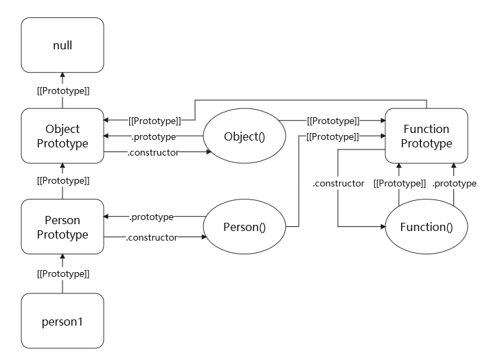

# JavaScript

HTML引入JS：

> script元素可写在head标签中 或  写在body标签的最后（防止阻塞页面加载）

1. 内嵌式：`<script>JS代码</script>`
2. 外部式【推荐】：`<script src="JS文件url"></script>` 
3. 行内式：写在元素内部，例如`<input type="button" onclick="JS语句">`
4. 动态加载：通过DOM创建script标签，此方式创建的script元素相当于添加了async属性，考虑兼容性，可将async属性设置为false
   - 动态加载的资源对浏览器预加载器不可见，可以通过link标签预加载


## 基本语法

标识符：变量、函数、属性、函数参数的名称

- 由字母、数字、下划线、$组成。不能以数字开头或使用关键字。建议用小驼峰

注释：

```js
// 单行注释

/* 
   多行注释
*/
```


### 数据类型

> JS是弱类型语言，无需进行类型声明，可在任何阶段改变变量的数据类型
>
> 原始类型：`String、Number、Boolean、null、undefined、Symbol、BigInt`
>
> 引用类型：`Object(Object、Function、Array)`
>
> - 所有对象都是Object类型，Function是可执行的Object，Array是属性为数值下标，且内部数据有序的Object


#### 空类型

- Undefined：代表未初始化的变量。该类型只有undefined一个值。声明而不初始化变量时，变量值为undefined
- Null：表示一个空对象指针，该类型只有null一个值。建议使用null对保存对象类型的变量进行初始化


#### Boolean

> 布尔型，值有true、false

转换为布尔型：`Boolean(值)` ，if等流程控制语句会自动执行此转换


`Boolean(值)` 转换规则：

- 转换为true：非空字符串、非零数值（包括无穷值）、任意对象（空对象、空数组）
- 转换为false：空字符串、0和NaN、null、undefined


#### Number

> 数值型，包含整型和浮点型。采用 双精度64位二进制格式IEEE754 编码

数值字面量：

- 进制表示：二进制：0b开头，八进制：0o开头【或0开头，不建议】，十六进制：0x开头
- 科学计数法表示：`系数e幂数` ，如 `3.12e7 === 31200000`
- 分割符：`100_0000`，解析时会忽视分隔符，仅用于提高阅读直观性


`Infinity` 和 `-Infinity`：无限值，表示超过`[Number.MIN_VALUE, Number.MAX_VALUE]`的数

- 任何非0值除以0或-0，将返回Infinity或-Infinity，详见[操作符](#操作符)


`NaN`：非数字，表示本来要返回数值的操作失败了

- 任何与NaN的运算操作，返回NaN，详见[操作符](#操作符)


转换为数值型：

- `Number(值)` 或 `+值`（一元加，返回值与Number一致）
- parseInt、parseFloat
- 除+外算术运算符隐式转换 `'12' - 0`、`'123' - '120'`


`Number(值)` 转换规则：

- 数值直接返回；true和false分别返回1和0；null 返回0；undefined 返回NaN；
- 如果是字符串，遵循下列规则：
  - 空字符串转换为0
  - 如果只包含数字（包括前面带正号或负号的情况），则将其转换为十进制数值
  - 如果是有效的浮点格式，如“1.1”，则将其转换为对应的浮点数值
  - 如果是有效的二/八/十六进制整数格式，例如"0xf"，则将其转换为相同大小的十进制整数值
  - 如果字符串中包含除上述格式之外的字符，则将其转换成NaN
- 如果是对象：
  - 调用其 valueOf()，返回值按上述规则转换，若结果不是NaN，返回结果
  - 否则调用 toString()，返回值按上述规则转换，返回结果


#### String

> 字符串型，字符串字面量可用单引号、双引号、反引号标识，字符编码[见上文](#字符编码)
>
> 字符串原始值和字符串包装对象共享大多数行为，原始值可使用各种实例属性和方法等
>
> 字符串是不可变的，修改某字符串的值时，会先销毁原字符串，再将包含新值的字符串保存到该变量
>
> 字符串若要跨行，可在每行末端加`\`后换行

转义字符：`\n` 换行、`\t` 制表符、`\b` 退格、`\r` 回车、`\f` 换页、`\\`、`\'`、`\”`、`\xnn` 十六进制编码nn表示的字符、`\unnnn` 十六进制编码nnnn表示的Unicode字符


模板字符串：用反引号 `` ` `` 标识的字符串，如 `` `abc` ``

- 模板字符串会保留字面量的换行符和空格，可以定义跨行字符串
- 字符串插值：通过在字面量中输入 `${JS表达式}` 实现，表达式的值会被转换为字符串并插入该位置
- 标签函数：通过 ``函数名`xxx${表达式1} 123${表达式2}404`  ``的方式调用函数
  - 函数接收到的参数依次为：由插值记号分隔的模板组成的数组、第一个表达式的值、第二个表达式的值...
- 原始字符串：原始的字符串字面量内容，而非转义后的内容
  - ``String.raw`模板字符串` ``：返回原始字符串
  - 字符串数组的.raw属性：返回原始字符串数组


转换为字符串：二元加号拼接字符串，或 String(值)


`String(值)` 转换规则：

- 若值为null，返回“null”
- 若值为undefined，返回“undefined”
- 若值有 toString 方法，调用该方法并返回结果
- 若值为原始值，转换为包装类后调用 toString 方法


`toString()` 除了null和undefined，所有引用类型都有该方法

- 返回值：
  - 数值：返回字符串形式的数值，可传入基数作为参数
  - 布尔值：返回`"true"` 或 `"false"`
  - Object：返回`“[object Object]”`
  - 自定义函数：返回源代码，内置函数返回`“function xxx() { [native code] }”`
  - Array：返回值同arr.join()，即每个值之间由逗号拼接的字符串
  - Date：返回当前时区的时间的字符串表示。如：`"Sun Jun 05 2016 10:04:53 GMT+0800 (中国标准时间)"`
  - RegExp：返回正则表达式字面量的字符串表示。如：`'/ab/i'`
  - Symbol：返回 `"Symbol(描述字符串)"`
- 注意：
  - 整数字面量直接调用toString，点会被识别为小数点，报错。正确使用：`(123).toString()`
  - 正负数字面量需要加上括号后调用toString，否则会先执行toString，然后运算正负号，返回数值型


#### Symbol

> 符号，ES6 新增的原始数据类型。符号实例唯一、不可变，不能与其他数据运算，用来创建唯一记号，用作非字符串形式的对象属性
>
> 使用符号作为属性：任何可以使用字符串作为属性的地方，都可以使用符号代替

获取实例：

- `Symbol(['描述字符串'])` ：返回符号实例，即使描述字符串相同，值也不同
- `Symbol.for(['描述字符串'])`：返回符号实例，以描述字符串为键，在全局符号注册表中创建并重用符号实例
  - 若注册表中不存在指定键值对，创建符号实例作为值添加到注册表，返回符号实例；若已存在，返回相应的符号实例
  - 即使描述字符串相等，注册表中定义的符号实例跟用 Symbol() 定义的符号实例也不等同


静态方法：

- `keyFor(symbol实例)` 在全局符号注册表中查询 symbol 实例的字符串键，若查询不到，返回 undefined


实例属性与方法：

- `description:str`：只读属性，返回描述字符串
- `toString:()=>str`：返回 `"Symbol(描述字符串)"`


内置符号：即Symbol的静态属性。将内置符号用作任意类/实例的属性，可以改变语言内部行为。

```ts
/**
 * 将方法返回值作为  某实例 instanceOf 该类  的返回值
 */
static [Symbol.hasInstance]: (instance) => bool

/**
 * 将返回的构造函数用于创建派生对象
 *   返回值是派生对象的方法：Array.prototype.map() .filter() .concat()
 *   例：该类的实例.map(...) 的返回值将该由指定构造函数创建
 */ 
static [Symbol.species]: () => 构造函数

/**
 * 定义 Object.prototype.toString.call(该实例) 返回值的标签名
 *   例：指定为 "Validator" ，则 toString.call 返回 "[object Validator]"
 */
[Symbol.toStringTag]: str

/**
 * 配置对象中值为 true 的属性将从 with(该实例) 的环境中排除
 */ 
[Symbol.unscopables]: { [prop:str]: bool }

/**
 * 转换为某类型原始值时，以该方法的返回值为结果
 *   该转换最优先，没有设置该属性的对象将通过 valueOf 和 toString 进行转换
 */ 
[Symbol.toPrimitive]: (hint: "number"|"string"|"default") => any

/**
 * 指定该实例的默认迭代器/异步迭代器
 */ 
[Symbol.iterator]: () => iterator
[Symbol.asyncIterator]: () => asyncIterator

/**
 * 指定该实例在被 concat 用作参数来合并时，是否展开
 *   对于数组对象，默认为true，对于类数组对象，默认为false
 */ 
[Symbol.isConcatSpeadable]: bool

/**
 * 指定为假值：标识该实例为非正则对象。
 *   例：正则对象/abc/标识后，用作startsWith等方法的参数时，视为字符串"/abc/"
 * 指定为函数：调用 "target".match(该实例) 时，将该函数的返回值作为match的返回值
 */ 
[Symbol.match]: false | (target:str) => any

/**
 * 调用 "target".replace(该实例, "replacement") 时，将该函数的返回值作为replace的返回值
 */ 
[Symbol.replace]: (target:str, replacement:str) => any
[Symbol.search]: (target:str) => any
[Symbol.split]: (target:str) => any
[Symbol.matchAll]: (target:str) => iterator
```


#### BigInt

> 大整数，用于表示任意大的整数

创建：

- 构造函数：`new BigInt(int|str)`
- 字面量：`123456789n`


特点：

- 支持 `+  -  *  /  **  %`  以及除了 无符号右移`>>>`外 的位运算符，不能使用一元加`+`
  - bigint只能于bigint运算，运算返回值为bigint。使用除法时，抹去结果的小数部分
- 支持使用关系/相等操作符与number进行比较（与number值相等时，==返回true，===返回false）


静态方法：

- `BigInt.asIntN(width:num, bigint):int`：将bigint转换为指定位数内的 **有符号整数**
- `BigInt.asUintN(width:num, bigint):int` 将bigint转换为指定位数内的 **无符号整数**


#### 类型判断

- `typeof 值`：返回数据类型的字符串表达，小写
  - 可能的返回值：“undefined”、“boolean”、“string”、“number”、“object”、“function”、“symbol”
  - null和array返回object、NaN返回number、函数返回function、未声明变量返回undefined
- `实例 instanceof 构造函数名`： 返回布尔，判断实例的原型链中是否包含指定构造函数的原型
- `Object.prototype.toString.call(变量)`：返回"[object 大驼峰类型名]"


### 操作符

> 优先级：括号 > 成员访问、带参数的 new、函数调用、可选链 > 无参数 new > 后置递增减 >  一元操作符 > 指数操作符 > 乘性操作符 > 移位操作符 > 关系操作符、in、instanceof > 相等操作符 > 按位与 > 按位异或 > 按位或 > 逻辑与 > 逻辑或 > 空值合并 > 条件操作符 > 赋值操作符 > yield > 逗号操作符
>

#### 一元操作符

> 用于非数值类型值时，**转换为数值再运算**

- 递增/递减操作符：`++ --` 
  - 用作操作数前缀：先递增减再返回值
  - 用作操作数后缀：先返回原值，再对原值递增减
- 一元加/一元减：`+ -` 用于操作数前，相当于正负号


#### 位操作符

> 用于非数值类型值时，**转换为数值再运算**
>
> 所有数值都以IEEE754的64位格式存储，但位操作符先把值转换为32位整数（NaN和Infinity转换为0），执行完位操作后再转换为64位
>
> 有符号整数使用32位的前31位（从右往左数）表示数值，第32位为符号位，0为正，1为负

- 按位非：`~` 用于数值前，返回数值的一补数（所有位取反，相当于对数值取相反数并减 1）
- 按位与/或/异或：`& | ^` 需要左右两个操作数，对两个数的每一位进行逻辑与/或/异或操作，返回数值
- 左移：`<<` 左操作数表示数值，右操作数表示移位位数。将数值的所有位向左移动，用 0 补充空位
- 有/无符号右移：`>> >>>` 将数值的 除符号位外所有位/所有位 向右移动指定位数，用 0 补充空位


#### 布尔操作符

> 短路逻辑：逻辑与/或 若要返回左操作数，就不会对右操作数进行求值

- 逻辑非：`!` 用于操作数前，返回操作数取反后的布尔值。若操作数不为布尔型，转换为布尔后求值
- 逻辑与：`&&` 需要左右两个操作数。若左操作数为真值，返回右操作数；否则，返回左操作数
- 逻辑或：`||` 需要左右两个操作数。若左操作数为真值，返回左操作数；否则，返回右操作数


#### 运算操作符

> 运算操作符都为二元操作符。用于非数值类型值时，**转换为数值再运算**（`+`除外）

- 乘性操作符：`* / %`
  - 无限值乘以0，返回NaN；无限值乘以非零值，返回无限值；
  - 无限值除以无限值，返回NaN；无限值除以有限值，返回无限值；±0除以±0，返回NaN；非零有限值除以0，返回无限值；
  - 无限值对所有数值取模，返回NaN；有限值对0取模，返回NaN；有限值对无限值取模，返回被除数；
- 指数操作符：`**` 结果同Math.pow()
- 加法操作符：`+`
  - 不同符号无限值相加，返回NaN
  - 返回数值：若操作数没有字符串或对象，所有操作数转换为数值，相加后返回
  - 返回字符串：若至少有一个操作数为字符串或对象，所有操作数转换为字符串，拼接后返回
- 减法操作符：`-`
  - 同符号无限值相减，返回NaN


#### 关系操作符

> 关系操作符都为二元操作符，返回布尔值

- `== != === !==`

  - !=和==先转换类型再比较，===和!==需要在不转换类型的前提下相等/不相等时，才返回true
  - 转换规则：
    - 对象 → 字符串 → 数值 ← 布尔
    - 两个操作数类型不同时，按上述路线转换，直到类型相同
  - 比较规则：
    - null 与 undefined 非严格相等，且比较前不进行类型转换（与其他值比较都不相等）
    - 若有一个操作数是NaN，则不相等【NaN不等于NaN】
    - 若两个操作数都是对象，仅当指向同一个对象时相等

- - 
  - 比较规则：
    - NaN不与任何值相等（NaN不等于NaN）
    - 若两个操作数都是对象，比较地址值

  

- `< > <= >=` 先转换类型再比较（转换规则同上）

  

#### 其他操作符

- 赋值操作符：`= *= /= %= += -= **= <<= >>= >>>= ||= &&= ??=`
  
  - 逻辑赋值运算符：`x ||= y`等同于`x || (x = y)`
- 条件操作符：`条件表达式 ? 表达式1: 表达式2`
- 逗号操作符：`a = (5, 2, 0)` 对它的每个操作数求值（从左到右），返回最后一个操作数的值
- in操作符：`"属性名" in 对象` 当可以通过对象访问到指定属性时，返回true
- new操作符：`new 构造函数()` 实例化类
  - `new.target`：用于函数中，若函数是通过new被调用的，则返回该构造函数的引用；否则返回undefined
- 可选链操作符：`obj?.a` 左结合，当左侧对象为 null 或 undefined 时，返回 undefined
  - 若左侧对象不为空，根据右侧值进行对象访问：
    - 访问属性：`obj?.a` / `obj?.["a-1"]`
    - 调用函数：`alert?.()`
  - 不得在 `new 构造函数` 和 `super` 后使用可选链操作符
- 空值合并操作符：`obj.name ?? 'Chen'` 当左侧值为 null 或 undefined 时，返回右侧值


### 语句

- if 语句：

  ```js
  if(表达式) 语句1
  if(表达式) {语句块1} [ else 语句1 或 {语句块2} ]
  ```

- do-while 语句：

  ```js
  do 语句1 while(表达式)
  do {循环体} while(表达式)
  ```

- while 语句：

  ```js
  while(表达式) 语句1
  while(表达式) {循环体}
  ```

- for 语句：

  ```js
  for([初始化表达式];[条件表达式];[循环后表达式]) 语句1
  for(...) 循环体
  ```

- for-in 语句：枚举可以通过对象访问(包括原型链上的)的**非符号**可枚举属性的属性名(字符串型)
  
  ```js
  for(变量 in 对象) 语句或循环体
  ```
  
- for-of 语句：枚举可迭代对象的元素，按 next() 方法产生值的顺序迭代元素
  
  ```js
  for(变量 of 可迭代对象) 语句或循环体
  ```
  
- 标签语句：给循环语句添加标签

  ```js
  标签:循环语句1
  ```

- break 和 continue 语句：仅用于循环语句内，退出指定循环 / 跳过本次循环，执行下次循环（会先判断循环条件）

  ```js
  break [标签];
  continue [标签];
  ```

- with 语句：with语句内部作用域设为传入的对象，不推荐使用

  ```js
  with(对象) 语句
  with(对象) 语句块
  ```

- switch 语句：使用全等判断值

  ```js
  switch(值){
      case 值1:
          语句1
          语句2
          ...
          break;
      case 值2:
          ...
      default:
          ...
  }
  ```

- try/catch/finally 语句：`try{} catch(err){} finally{}`

- void语句：返回undefined。 `void 表达式` 或 `void(表达式)`

  1. 立即执行函数的`()`可以用`void`替代

     ```javascript
     (function fn(){...})() // 普通的立即执行函数
     void function fn(){...}() // 用void表示
     ```

  2. 判断值是否为undefined

     ```javascript
     if(txt === undefined) // 存在名为undefined的变量时，会判断错误
     if(txt === void(0))
     ```
  
- throw语句：`throw Error实例`，暂停代码执行，向上抛出异常

- 声明语句：

  ```js
  声明关键字 变量名; // 声明变量，其值为undefined
  声明关键字 变量名 = 值; // 声明变量并初始化
  声明关键字 变量名1,变量名2; // 同时声明多个变量
  声明关键字 变量名1 = 值1, 变量名2 = 值2 // 同时声明多个变量并初始化
  ```

  


### 变量

声明关键字：声明语句见[语句](#语句)

- var：声明变量。变量被添加到最接近的函数/全局作用域，存在变量提升
- let：声明变量。
  - 不能声明已被 let、const 声明的当前作用域的同名变量
  - 变量被添加到最接近的函数/块级作用域，不存在变量提升
  - let、const、class 在全局作用域中声明的变量不会成为 Global 对象的属性
- const：声明常量。
  - 具有 let 的特点，外加：声明时必须同时初始化，常量的值不能修改


预解析：所有的 var 和 function 声明会被提升到当前函数/全局作用域的顶部

- var初始化时，初始化代码会被拆分，只提升声明部分
- 若函数声明位于赋值语句右侧时，不会被提升


变量可包含两种类型的值：

- 原始值：原始数据类型，存储于栈内存。变量保存实际值，原始值不能有属性。
- 引用值：引用数据类型，存储于堆内存。变量保存地址值


解构赋值：用于可迭代对象，根据迭代协议进行解构

- 扩展操作符：`...可迭代对象` 取出对象/数组中的可遍历属性，返回逗号分割的参数序列
  - 浅复制对象：`let obj2 = {...{a:1, b:2}};`
  - 浅复制数组：`let arr2 = [...[1, 2]];`
  - 接收rest参数：`(...args)=>{}` args为数组，变量名不作限制
- 数组解构赋值：
  - `let [a, b, c=10] = [1, 2, 3];`
  - 等号右边需要是可遍历结构
  - 解构不成功则变量值为 undefined
  - 仅当右侧解构得到的值严格等于 undefined 时，被赋值变量的默认值才会生效
- 对象解构赋值：

  - `let { bar = 'abc', foo:f} = { foo:'aaa', bar: 'bbb'}`
  - 'aaa'会被赋值给 f(变量部分) 而非 foo(模式部分)
  - 对象的解构赋值可以取到继承的属性
  - 等号右边若为字符串、数值、布尔，会尝试转换为对象再赋值
  - 解构赋值内部仅在赋值语句的非模式部分可以使用圆括号


## 深入JS

> 浏览器包含渲染引擎和JS引擎，前者解析HTML和CSS，也称内核，后者处理JS代码。
>
> JS由ECMAScript（JavaScript语法）、DOM（页面文档对象模型）、BOM（浏览器对象模型）组成

### JS执行机制

> 事件循环：即执行机制的2~8步
>
> （宏）任务：script（全局任务），setTimeout，setInterval，setImmediate，I/O，UI rendering
>
> 微任务：process.nextTick，Promise，Object.observer…

执行机制：

1. 所有代码作为全局任务进入宏任务队列
2. 从宏任务队列出队一个任务，进入主线程执行栈
3. 执行代码：遇到同步代码立即执行，遇到异步代码则注册回调函数
   - 当指定的条件达成后，注册的回调函数将移入宏任务/微任务队列
4. 执行完毕，执行栈清空后，从微任务队列出队一个任务，进入主线程执行栈并执行
5. 重复第4步，直至微任务队列清空
6. 执行浏览器ui渲染
7. 检查是否有webworker任务，有则执行
8. 返回第2步


进程与线程：JS是单线程运行的，使用Web Workers可以多线程运行


浏览器内核：支撑浏览器运行的最核心的程序。内核由很多模块组成：

- 主线程模块：js引擎模块；html，css文档解析模块；DOM/CSS模块；布局和渲染模块 ......
- 分线程模块：定时器模块；事件响应模块；网络请求模块


### 字符编码

> 码元：一个长度为16比特（2字节）的编码
>
> 码点：由一个或多个码元组成的，表示一个字符的编码。码点值等于Unicode编码值（十六进制数值）
>
> Unicode中，基本汉字编码在U+4E00 ~ U+9FFF

JS中字符串使用两种Unicode编码混合的策略：UCS-2和UTF-16

- UCS-2：适用于Unicode编码在U+0000~U+FFFF的字符，一个码点对应一个码元
- UTF-16：对于Unicode编码超过U+FFFF的字符，采用该策略。对于UCS-2不能表示的字符，每个字符会用另一个码元去选择一个增补平面，这种每个字符使用两个16位码元的策略称为代理对。


### 严格模式

> 在脚本开头加上  `"use strict";` 开启严格模式，或在函数开头加上该指令，使函数在严格模式下执行

在严格模式下：

- 使用未声明变量时报错；delete未声明变量时抛出异常；用0作为前缀表示八进制字面量时抛出异常
- LHS引用时，若在全局作用域也找不到变量，会创建一个全局变量（非严格模式）/ 抛出异常（严格模式）
- 函数内部的this不允许指向window，会置为undefined。但定时器回调函数的this及在全局作用域下直接使用this不受影响
- 不允许使用with语句
- 对函数的限制：函数不能以eval或arguments作为函数名或形参名；两个命名参数不能拥有同一个名称
- eval内部创建的变量和函数无法被外部访问
- 只设置了获取函数/设置函数的访问器属性，尝试修改/读取属性会抛出异常
- ...


### 左值与右值

左值与右值：

- 左值：可以出现在赋值语句左边或右边。特征为可以获取地址
- 右值：只能出现在赋值语句的右边，特征为不能获取地址，不能被赋值，临时变量及数字字面量一般为右值


LHS和RHS查询：

- LHS（Left-hand Side）引用：通常指等号（赋值操作）的左边的变量，是赋值操作的目标
- RHS（Right-hand Side）引用：通常指等号（赋值操作）的右边的变量，仅查找并获取它的值
- 沿词法环境查找，若全局词法环境中没有值，RHS抛出异常，LHS会自动创建一个全局变量（非严格模式）/ 抛出异常（严格模式）


### 上下文与内存

#### 执行上下文

> 执行上下文，简称上下文，是JS代码的运行环境
>
> 注：ES3版本上下文由this、变量对象VO、作用域链三个属性组成；ES5版本为了兼容块级作用域进行了更改，如下文所示

上下文分类：

- 全局执行上下文：任何不在函数内部的代码都在全局上下文中。一个程序中只有一个全局上下文
- 函数执行上下文：函数被调用时，会为该函数创建一个上下文。每个函数都有它自己的上下文
- Eval 函数执行上下文： 执行在 eval 函数内部的代码也会有一个独立的上下文


执行上下文栈：也称调用栈、执行栈。程序开始时，将全局上下文压入调用栈，并执行


上下文的生命周期：

1. 创建阶段：JS代码执行前，进行以下步骤：
   1. 创建 词法环境 组件
      - 词法环境是一个环境记录，存储除var外的绑定
      - 词法环境内部可以再新建词法环境，需要获取上下文的词法环境时，会取最内层的词法环境。这些词法环境属于该上下文。
      - 实际词法环境是一个树形结构的，单个上下文只是创建并引用了树的一个词法环境，词法环境并不一定随上下文销毁而销毁。
   2. 创建 变量环境 组件
      - 变量环境是一个环境记录，仅存储var声明变量绑定
   3. 对this进行绑定
      - 创建全局上下文时：会先创建 Global 对象，并且设置 this 的值等于 Global 对象
      - 创建函数上下文时：若函数被对象调用，this指向该对象。否则指向 Global对象 或 undefined（严格模式）
      - 注：this实际是环境记录的属性，并非所有环境记录都有this属性，上下文需要使用this时，会沿环境记录链读取this。
2. 执行阶段：执行代码，过程中若创建了新的上下文，压入调用栈，并去执行
3. 回收阶段：上下文出栈，等待虚拟机回收


环境记录：是一种持有 **标识符→变量值/函数值 的映射** 的结构

- 外部环境引用：每个环境记录都有该字段，保存父级环境记录的引用，引用组成链式结构，称为环境记录链
  - 全局环境的外部环境引用为null、函数环境的外部环境为定义函数时所在的环境记录
- 环境记录的类型：
  - 对象式环境记录：有一个与之绑定的对象，以对象属性的形式进行映射绑定
  - 声明式环境记录：定义将标识符与值绑定的 ES 语法，如let、class、import等
  - 函数环境记录：声明式环境记录的子类，具有函数参数、arguments 对象等的绑定
  - 模块环境记录：声明式环境记录的子类，体现一个模块的外部作用域 export ，并提供外部引入模块的绑定 import
  - 全局式环境记录：是对象式环境记录和声明式环境记录的复合封装
    - 其对象式环境记录：绑定的对象为Global对象，全局var变量绑定于该对象
    - 其声明式环境记录：绑定全局声明的let、const等


作用域：

- 作用域是一套根据标识符查找变量值的规则。它的具体实现是环境记录
- 作用域链：原ES3中执行上下文的一个属性，包含当前上下文的所有父级上下文，用于查找标识符。对应ES5规范中的环境记录链。


JS功能的具体实现：

- 块级作用域：遇到块级作用域时，会在当前上下文词法环境内新建一个声明式环境记录，在该环境记录中存储映射绑定。

- 值的查找：在当前上下文的词法环境中查找，如果找不到，沿词法环境链向上查找。在词法环境链上若遇到上下文新建时创建的词法环境，则查找上下文的变量环境，然后继续沿词法环境链向上查找。

  - 函数闭包：函数内找不到值，所以进入父级词法环境也就是定义函数的词法环境、变量环境查找值。

- with语法：语句块内部提供一个对象式环境绑定（绑定传入对象）

- this的查找：在当前上下文的词法环境中查找，如果找不到，沿词法环境链向上查找

  - 普通函数的this：普通函数在上下文创建时会绑定this，所以在当前上下文中一定能获取this

  - 箭头函数的this：箭头函数创建函数式环境记录时，不会绑定this值，所以进入父级词法环境也就是定义箭头函数的词法环境查找this（捕获定义处的this）
  
    

#### 内存

垃圾回收：通常有两种策略，因浏览器而异

- 标记清除：在上下文的回收阶段，清除所有变量绑定
- 引用计数：记录每个值被引用的次数，声明变量并赋引用值时，值的引用数为1，当同一个值又被赋给另一变量时引用数加1。
  - 当引用该值的变量被其他值覆盖，引用数-1，当一个值的引用数为0时，回收。（问题：循环引用）


## 基本引用类型

### Date

创建实例：`new Date([时间戳])`，若不指定参数，则保存当前系统时间

- 传入字符串时，构造函数会隐式调用 parse 和 UTC 方法


静态方法：

- `parse('日期字符串')`：解析字符串，返回对应的时间戳，解析失败返回NaN
  - 支持的日期格式：（若不指定时区，视为本地时区）
    - 月/日/年：`"5/23/2019"`
    - 月名 日, 年：`"May 23, 2019"`
    - 周几 月名 日 年 时:分:秒 时区：`"Tue May 23 2019 00:00:00 GMT-0700"`
    - YYYY-MM-DDTHH:mm:ss.sssZ：`"2019-05-23T00:00:00"`
- `UTC(年[,零起点月][,日][,时][,分][,秒][,毫秒])`：传入UTC时间，返回对应时间戳，参数为数字型，日默认为1，其他默认为0
- `now()`：返回当前系统时间的时间戳


实例方法：

```js
getTimezoneOffset() // 返回以分钟计的UTC与本地时区的偏移量（若本地快，偏移量为负）
toString() / toLocaleString() // 返回 带时区的日期和时间/带AM或PM的本地日期和时间 （因浏览器而异）
valueOf() // 返回当前实例保存时间的时间戳

// 以下方法用于获取或设置实例保存时间
// 所有set方法可加UTC，按UTC更改时间，如：setUTCHours
getTime() / setTime(毫秒数) // 时间戳
getFullYear() / setFullYear(int) // 年
getMonth() / setMonth(int) // 月（0~11）
getDate() / setDate(int) // 日
getDay() // 周几（0为周日，6为周六）
getHours() / setHours(int) // 时（0~23）
getMinutes() / setMinutes(int) // 分钟
getSeconds() / setSeconds(int) // 秒
getMilliseconds() / setMilliseconds(int) // 毫秒
```


### RegExp

创建实例：

- 构造函数：`new RegExp("模式字符串" | RegExp实例 [,"标记字符串"])`
  - 模式字符串中的转义字符在某些时候需要二次转义（`\n`要写为`\\n`）
- 字面量：`/模式/标记`


匹配模式：以下为匹配模式的标记字符，标记字符串由单个或多个标记字符组成

- `i`：不区分大小写
- `g`：全局模式，不在匹配到第一个内容时结束
- `m`：多行模式，查找到一行文本末尾时会继续查找
- `u`：开启Unicode匹配
- `s`：dotAll模式，元字符 . 匹配任何字符
- `y`：粘附模式，将lastIndex开始及之后的字符串作为源字符串，且模式字符串的开头会被隐式加上`^`


静态属性：以下所有属性均为非标准属性，不应在生产环境中使用

- `input / $_`：最后搜索的字符串
- `lastMatch / $&`：最后匹配的文本
- `lastParen / $+`：最后匹配的捕获组
- `` leftContext / $` ``：input属性中出现在lastMatch前的文本
- `rightContext / $'`：input属性中出现在lastMatch后的文本
- `$1 ~ $9`：分别包含第1-9个捕获组的匹配项


实例属性：

- `global / ignoreCase / unicode / sticky / multiline / dotAll`：布尔型，表示 g/i/u/y/m/s 模式是否开启
- `source / flags`：模式/标记字符串
- `lastIndex: int`：在源字符串中下次搜索的开始位置（仅test和exec方法有效）
  - 如果匹配模式g或y未开启，该属性会被忽略
  - 不会因源字符串改变而改变
  - 每次匹配成功后，该值被设置为成功匹配的下一个位置的索引；匹配失败后，该值被设置为0


实例方法：

- `exec('源字符串')`：返回包含匹配信息的数组；匹配失败返回null
  - 数组的第一个元素为匹配整个模式的子串，其余元素为表达式中捕获组匹配的子串
  - 数组还具有属性：
    - `groups:{ [捕获组名:str]: str }`：具名捕获组匹配的子串
    - `input: str`：源字符串
    - `index: int`：匹配整个模式的子串的起始索引
- `test('源字符串'): bool`：检查字符串是否与模式匹配
- `toString() / toLocaleString()`：返回正则表达式字面量的字符串表示
- `valueOf()`：返回实例本身


#### 正则表达式

> JS正则表达式仍缺少：\A和\Z锚、联合及交叉类、原子组、x（忽略空格）匹配模式、条件式匹配、正则表达式注释

##### 位置匹配符

- `^`：匹配字符串的起始位置。若开启多行匹配模式，也将匹配换行符后紧跟的位置
- `$`：匹配字符串的结束位置。若开启多行匹配模式，也将匹配换行符前紧跟的位置
- `\b`：匹配单词边界（“字”与非“字”之间的位置）
- `\B`：匹配非单词边界


##### 元字符

- `.`：匹配除换行符外，任意单个字符。若开启dotAll模式，也将匹配换行符
- `\w`：匹配一个“字”字符（字母、数字、下划线），等价于 `[A-z0-9_]`
- `\W`：所有 \w 不匹配的单个字符
- `\s`：单个空白符，包括制表符、换行符等。
  - 等价于`[\f\n\r\t\v\u0020\u00a0\u1680\u180e\u2000-\u200a\u2028\u2029\u202f\u205f\u3000\ufeff]`。但经测试 \s 不匹配 \u180e
- `\S`：所有 \s 不匹配的单个字符
- `\d`：匹配一个数字字符，等价于 `[0-9]`
- `\D`：所有 \d 不匹配的单个字符


##### 限定符

> 贪婪匹配：`* + ? {}` 限定符默认为贪婪匹配（匹配尽量多的字符），在它们后面加 `?` ，将改为非贪婪匹配（匹配尽量少的字符）

- `*`：匹配前面的字符 0 次或多次。等价于 `{0,}`
- `+`：匹配前面的字符 1 次或多次。等价于 `{1,}`
- `?`：匹配前面的字符 0 次或 1 次。等价于 `{0,1}`
- `{n}`：匹配前面的字符 n 次
- `{n,}`：匹配前面的字符最少 n 次
- `{n,m}`：匹配前面的字符最少 n 次最多 m 次。


##### 字符集合

> 字符集合匹配单个字符，匹配范围在 [] 内部指定，`+*-?`等特殊字符在字符集合内无需转义

- 匹配方括号内所有字符：`[aeiou]`、`[a-z]`、`[A-z]`、`[0-9]`
- 匹配除方括号内所有字符：`[^aeiou]`、`[^a-z0-9]`
- 匹配中文：`[\u4e00-\u9fa5]`
- 匹配双字节字符：`[^\x00-\xff]`


##### 逻辑或

`a|b`：匹配左侧字符串或右侧字符串（使用位置限定符需留意）

```js
/^abc|d$/.test('abc ') // true
/^abc|d$/.test(' d') // true
/^(abc|d)$/.test('abc ') // false
/^(abc|d)$/.test('abc') // true
```


##### 特殊字符

- 转义：`{ } [ ] ( ) \ ^ $ | ? * + .`   上述字符前可加 `\` 进行转义
- `\cX`：匹配一个控制符（X 是处于 A 到 Z 之间的字符）
- `[\b]`：匹配一个退格符
- `\f`：匹配一个换页符 (U+000C)
- `\n`：匹配一个换行符 (U+000A)
- `\r`：匹配一个回车符 (U+000D)
- `\t`：匹配一个水平制表符 (U+0009)
- `\v`：匹配一个垂直制表符 (U+000B)
- `\0`：匹配一个 NULL（U+0000）字符
- `\0<digits>`：匹配一个八进制数表示的字符
- `\xhh`：匹配一个两位十六进制数（\x00-\xFF）表示的字符
- `\uhhhh`：匹配一个四位十六进制数表示的 UTF-16 代码单元
- `\u{hhhh}` 或 `\u{hhhhh}`：需开启 Unicode 匹配模式，匹配一个十六进制数表示的Unicode字符


##### 分组

> 括号整体可视为一个字符，以使用限定符

- `(pattern)`：捕获括号。根据模式匹配，并记住匹配项
- `(?<组名>pattern)`：命名捕获括号，作用同捕获括号，但可以指定组名
- `(?:pattern)`：非捕获括号。根据模式匹配但不记住匹配项
- `(?=pattern)`：先行断言。当前位置**之后**的字符序列必须**能**与pattern匹配
- `(?!pattern)`：先行否定断言。当前位置**之后**的字符序列必须**不能**与pattern匹配
- `(?<=pattern)`：后行断言。当前位置**之前**的字符序列必须**能**与pattern匹配
- `(?<!pattern)`：后行否定断言。当前位置**之前**的字符序列必须**不能**与pattern匹配
- `\n`：反向引用。返回第 n（n≥1）个捕获括号的匹配项


### 原始值包装类型

> 可以通过 new 操作符创建原始值包装类型的实例，会根据传入构造函数的值，创建实例。
>
> 以读模式访问原始值时【获取值或调用其方法，如 需调用toString时】，后台会执行：创建一个对应原始包装类型的实例、调用实例方法、销毁实例

#### String

创建实例：`new String(值)` 值会自动通过 `String()`转换后存于实例中


静态方法：

- `fromCharCode(多个数值)` 每个数值对应一个码元，按顺序拼接为字符串返回
- `fromCodePoint(多个数值)` 每个数值对应一个码点，按顺序拼接为字符串返回
- `` raw`模板字符串` `` 返回原始字符串
- `raw({raw:[多个字符串],多个插值})` 用插值拼接字符串数组，返回原始字符串
  - `raw({raw:['name:', ', age:', ', sex:']}, 'CHEN'.toLowerCase(), 17+2, 'male')`


实例属性：`length` 表示字符串中码元的数量


实例方法（基本）：

- `valueOf()、toLocaleString()、toString()`：返回对象的原始字符串值

- `charAt(索引号) / str[索引号]`：返回指定索引位置的码元对应的字符

- `charCodeAt(索引值)`：返回指定索引位置的码元的值的十进制整数表示

- `codePointAt(索引值)`：返回指定索引位置的码元所在码点的值的十进制整数表示
  - 若指定码元不是码点的开头，会返回错误的码点值；可以解构字符串再遍历

- `normalize(“NFD”/“NFC”/“NFKD”/“NFKC”)`：返回规范化后的字符串，可选四种规范化形式之一
  - 有些 Unicode 字符具有多个编码，通过采用相同规范化形式将这些编码转换为一致的编码。


实例方法（获取子串）：

- `substr(start, 长度) / slice(start, end) / substring(start, end)`：返回从指定索引截取的子串
  - 三个方法都可以省略第二个参数，若省略则取到末尾
  - substr 把 start 负参数转换为字符串长度加 start、把长度负参数转换为 0；slice 转换所有负参数为字符串长度加该值；substring 转换所有负参数为 0。所有负参数若转换后仍为负，则转换为 0
  - slice 第二个参数小于第一个时，返回“”；substring 自动取较小的参数为 start，较大的为 end
- `split(字符串/正则表达式，数组长度上限)` ：返回将字符串按分隔符分隔后的字符串数组


实例方法（格式检测）：

- `match(字符串/正则表达式)`：返回值同 RegExp 的实例方法 exec()
- `matchAll(正则表达式)`：返回值迭代器，包含多个匹配项的匹配结果(参考 match())
- `indexOf('子串' [, start]) / .lastIndexOf(...)`：返回从前往后/从后往前第一次匹配到子串的索引，若匹配失败，返回-1
- `search(字符串/正则表达式)`：返回第一个匹配子串的起始索引，若没有搜索到返回-1
- `startsWith('子串' [, start])/ endsWith('子串' [, end]) `：返回布尔，表示字符串是否以子串开头/结尾。end 相当于将字符串末尾定于指定索引处
- `includes('子串' [, start])`：返回布尔，表示字符串是否包含子串
- `localeCompare(字符串)`：按字母表顺序逐位比较，排在后面的字母大（各语言有对应的字母表）
  - 若字符串小于参数字符串，返回负值【通常为-1】；等于返回 0；大于返回正值【通常为 1】


实例方法（加工字符串）：

- `trim()/ trimStart()/ trimEnd()` ：返回删除前后所有/前面所有/后面所有空格符的字符串副本

  - trimLeft 和 trimRight 方法分别为 trimStart 和 trimEnd 方法的别名

- `repeat(整数)`：将字符串复制指定次，返回拼接所有副本后的字符串

- `concat(多个字符串)` ：返回拼接后的字符串(将参数按顺序追加在实例字符串后方)，等效于+

- `padStart(长度[, '填充字符串'=' '])/ padEnd(...)`：返回新字符串，以填充字符串在调用字符串 前/后 填充至指定长度

  ```javascript
  '12'.padStart(10, 'YYYY-MM-DD') // "YYYY-MM-12"
  '09-12'.padStart(10, 'YYYY-MM-DD') // "YYYY-09-12"
  ```

- `toLowerCase()/ toUpperCase()`：返回按照通用规则转换为小写/大写后的字符串

- `toLocaleLowerCase()/ toLocaleUpperCase()`：返回按照各语言规则转换为大写/小写后的字符串(推荐)

- `replace(字符串/正则表达式，'替换字符串'/ fn())` ：返回修改过的字符串，用替换字符串/fn 的返回值替换匹配到的子串

  - 替换字符串中可用特殊的字符序列表示指定值：\$\$【\$】、\$&【匹配整个模式的字符串】、\$'【匹配的子串之前的字符串】、\$`【匹配的子串之后的字符串】、\$n【匹配第 n 个捕获组的字符串，n 为 0-9】、\$nn【匹配第 nn 个捕获组的字符串】
  - fn 参数：与整个模式【一个匹配项】/捕获组【多个匹配项】匹配的字符串、匹配项在字符串中的起始位置、源字符串

- `replaceAll(字符串/正则表达式，'替换字符串'/ fn())`：返回修改过的字符串，替换全部


#### Number

创建实例：`new Number(值)` 值会自动通过 Number() 转换后存于实例中


静态属性：

- `EPSILON`：JS表示的最小精度
- `MAX_SAFE_INTEGER / MIN_SAFE_INTEGER`：最大/最小安全整数，即`-2**53+1 / 2**53-1`
- `MAX_VALUE / MIN_VALUE`：最大/最小正数
- `NEGATIVE_INFINITY / POSITIVE_INFINITY`：负无穷大值/正无穷大值，溢出时返回该数


静态方法：

- `isFinite(值) / isNaN(值)`：返回布尔，判断值是否有穷/是否是非数
  - 不同于window对象上的同名方法，这两者不会对传入值进行类型转换
- `isInteger(值) / isSafeInteger(值)`：返回布尔，判断值是否为整数 / IEEE754数值格式范围内的整数
- `parseInt(字符串[,基数]) / parseFloat(字符串)`：返回数值
  - 同window对象上的同名方法
  - 会将传入值转换为字符串再解析（即使传入数值，也会先转换为字符串）
  - 从第一个非空白字符开始解析，若第一位就无法解析则返回NaN
  - 遇到不能解析的内容时，会解析前面可解析的子串，并返回结果


实例方法：

- `valueOf()`：返回原始值
- `toLocaleString([基数])/ toString([基数])`：返回数值字符串
- `toFixed(小数位数)`：返回数值字符串，保留指定位数小数【四舍五入】
- `toExponential(小数位数)`：返回以科学计数法表示的数值字符串，保留指定位数小数【四舍五入】
- `toPrecision(数字总位数)`：根据情况返回固定长度或科学计数法形式（指数不计入数字总位数）的数值字符串【四舍五入】


#### Boolean

创建实例：`new Boolean(值)` 值会自动通过 Boolean() 转换后存于实例中


实例方法：

- `valueOf()`：返回原始值true/false
- `toString()`：返回字符串"true"/"false"


### 单例内置对象

#### Global

> Global对象是一种兜底对象，使用var定义于全局作用域的变量和函数都会成为其属性

访问Global对象：

- 方法一：浏览器中Global对象作为window对象的一部分，可通过window的同名属性访问Global
- 方法二：`globalThis` 指向全局this，在浏览器中即window


实例属性：

- undefined、NaN和Infinity等特殊值
- 所有原生引用类型构造函数（如Object、Function等）都是Global对象的属性


实例方法：

- `eval("JS代码")`：同步执行代码，相当于在原地插入代码
  - 严格模式下，无法在外部访问eval创建的变量；执行性能较差，且具有安全隐患
- `encodeURI/decodeURI("uri"):str`：编码/解码不属于URL组件的特殊字符`#/?:`
- `encodeURIComponent/decodeURIComponent("uri"):str`：编码/解码所有非标准字符


#### Math

实例属性：

> 均为数值型

- `E`（自然常数）、`PI`（圆周率）
- `LN10`（E为底，10的对数）、`LN2`（E为底，2的对数）
- `LOG2E`（2为底，E的对数）、`LOG10E`（10为底，E的对数）
- `SQRT1_2`（0.5的平方根）、`SQRT2`（2的平方根）


实例方法：

> 均返回数值，与角度相关的数值均**以弧度为单位**

- `max/min(多个num)`：最大值/最小值，若没有参数，返回 -Infinity / Infinity
- `random()`：返回 [0, 1) 范围的随机小数
- `abs(num)`：绝对值
- `sign(num)`：根据数值符号返回1、0、-0、-1、NaN
- `floor/ceil/round/trunc(num)`：向下取整 / 向上取整 / 四舍五入（负数.5往正方向取）/ 抹去小数部分
- `pow(x:num, n:num)`：x 的 n 次幂
- `exp/expm1(num)`：E 的 参数/参数-1 次幂
- `hypot(多个num)`：所有数平方和的平方根
- `sqrt/cbrt(num)`：平方根 / 立方根
- `log/log10/log2(num)`：以 E/10/2 为底，参数的对数
- `log1p(num)`：以 E 为底，参数+1 的对数
- `cos/cosh/acos/acosh(num)`：余弦 / 双曲余弦 / 反余弦 / 反双曲余弦
- `sin/sinh/asin/asinh(num)`：正弦 / 双曲正弦 / 反正弦 / 反双曲正弦
- `tan/tanh/atan/atanh(num)`：正切 / 双曲正切 / 反正切 / 反双曲正切
- `atan2(y:num, x:num)`：返回 X轴正方向 到 线段 (0, 0) 至 (x, y) 的角度（单位为弧度）
- `fround(num)`：返回数值最接近的单精度（32位）浮点值表示
  - 可用于解决64位浮点数比较不正确的问题：`fround(0.1+0.2) === fround(0.3)`
- `imul(x:num, y:num)`：转换参数为32位整数后相乘，返回结果（性能好）
- `clz32(num)`：转换为32位无符号整数的二进制后，返回开头0的个数


## 集合引用类型

Object：详见[类与对象](#Object)

### Array

> 数组，一种特殊对象，使用 0,1,2... 的索引存储元素
>
> 数组空位：`[, , , ]` 空位处理规则不统一，避免出现空位

创建：

- 数组字面量：`["xx", 18, true]`，不会调用Array构造函数
- 通过构造函数：`[new] Array(length | 多个值)` 生成指定长度空数组 / 按参数生成数组
- 通过from方法与of方法：见静态方法


访问数组：`arr[索引值]`，通过 数字 / 字符串型数字 访问指定索引处的元素

- 若对数组长度外的索引值进行设置，自动扩容数组
- 若对数组长度外的索引值进行读取，返回undefined


实例属性：

- `length: num` 获取 / 设置数组长度
  - 若设置值大于原长，则用undefined扩充数组；若小于原长，删去多余元素


静态方法：

- `from(类数组对象[,映射函数[,this]])`：返回将类数组转换后的数组实例
  - 类数组对象：可迭代对象或有length属性和可索引元素的结构
  - 映射函数：接收元素为参数，对数组内所有元素执行函数，将返回值作为数组实例对应位置的值
  - this：该参数将作为映射函数中this的值，若映射函数为箭头函数则不适用
- `of(多个值)`：将一组参数按顺序转换为数组实例
- `isArray(值):bool`：判断是否为数组


#### 实例方法

基本：

- `valueOf()`：返回实例本身
- `toString/toLocaleString():str`：对所有元素调用toString/toLocaleString后用逗号拼接
- `at(整数)`：返回对应位置的成员，支持负索引

- `keys/values/entries()`：返回 数组索引/数组元素/索引值对 的迭代器
- `includes(值):bool`：检测值是否存在于数组
- `indexOf/lastIndexOf(值)`：返回值在数组中 第一次/最后一次 出现时的索引值，不存在则返回-1


简单加工：

- `push/unshift(多个值)`：在 数组末尾/头部 按参数顺序添加元素，返回修改后数组的长度
- `pop/shift()`：删除数组 最后/最前 一个元素，返回删除的元素（修改原数组）
- `join(分隔符:str=','):str`：对所有元素调用 toString 后用分隔符拼接（null和undefined转换为""）
- `slice([start[, end]])`：返回新数组，包含实例指定区间的元素
- `splice(start, 删除个数[, 多个值])`：删除数组元素，并在删除处添加元素，返回被删除元素组成的数组（修改原数组）
- `fill(值[, start[, end]])`：将指定范围内的元素填充为参数（支持负索引，忽略反向索引），返回修改后的数组
- `copyWithin(索引值[, start[, end]])`：将实例[start, end)区间的元素复制到索引处（支持负索引，忽略反向索引），返回修改后的数组
- `concat(多个值)`：按顺序添加参数（自动解构数组参数）到数组末尾，返回新数组
- `reverse()`：翻转数组，返回修改后的数组
- `sort([(a, b) => 值])`：排序数组，返回修改后的数组
  - 若比较函数返回负值，则 a 排在 b 之前
  - 若不传参数，根据每一个元素调用 String() 的结果字符串升序排列
- `flat(n:int=1)`：返回新数组，将数组转换为低 n 维的数组
- `flatMap(映射函数)`：相当于调用 `map(映射函数).flat(1)`


迭代：

- `find/findIndex/findLast/findLastIndex((el, i, arr) => {}[, thisArg])`
  - 遍历元素执行函数，若有一项的子函数返回真值，结束遍历并返回 该元素/该元素的索引，找不到返回 undefined/-1
  - findLast/findLastIndex：功能同上，从右往左迭代
- `every/some(同find)`：遍历元素执行函数，若 每一项/有一项 返回真值，则返回true，否则返回 false
- `forEach(同find):void`：遍历元素执行函数
- `map/filter(同find)`：遍历元素执行函数，返回由 函数返回值 / 函数返回真值的项 组成的新数组
- `reduce/reduceRight(fn(acc, current, i, arr){}[, acc初始值])`
  - 从左向右/从右向左 遍历元素执行函数（若不传初始值，从第二项开始迭代，第一项作为 acc），最后一次的返回值作为返回值
  - acc 为累积器，在第一次调用时为初始值，之后为前一次调用的返回值。current 为当前项


### 二进制数组

> 字节序：字节序由 JS 运行时所在系统决定，大端/小端字节序表示高位字节处于低位字节的前侧/后侧
>
> ElementType：`Int8`（8 位整数）、`Uint8`（8 位无符号整数）、`Int16`、`Uint16`、`Int32`、`Uint32`、`BigInt64`、`BigUint64`、`Float32`、`Float64`、

#### ArrayBuffer

> 缓冲，代表储存二进制数据的一段内存，不能直接读写，是所有定型数组及视图引用的基本单位，可被垃圾回收机制回收。
>

创建：`new ArrayBuffer(字节数)` 在内存中分配一段连续区域，创建后不能调整大小，初始值为 0

实例属性：`byteLength`：只读，字节数

实例方法：`slice()`：同数组的方法

静态方法：`isView(值):bool`：检测参数是否为 ArrayBuffer 的视图实例(DataView 和TypedArray）


#### DataView

> 一种视图，专为文件和网络 I/O 设计，支持对缓冲数据的高度控制，相比其他视图性能略差，对缓冲内容无预设，无法迭代，无需考虑字节序

创建：`new DataView(ArrayBuffer实例 [,byteOffset[,byteLength]])`

- 从 ArrayBuffer 的指定字节处截取指定字节数创建，默认使用全部 ArrayBuffer

实例属性：`buffer`（创建时传入的实例）、`byteLength`、`byteOffset`

实例方法：`getInt8(byteOffset) / setInt8(byteOffset, 值)` 从指定索引的字节处开始，获取/设置一个 8 位整数

- 所有 ElementType 都有对应的get与set方法


#### TypedArray

> 定型数组，一种视图，特定于一种 ElementType 并且遵循系统原生的字节序
>
> 溢出处理：上溢和下溢表示超过类型的最大/最小值。上溢和下溢不影响其他数组成员。上溢时舍去溢出部分

定型数组是多个类型的统称，类型有：`Int8Array`、`Uint8Array`、`Uint8ClampedArray`、`Int16Array`、`Uint16Array`、`Int32Array`、`Uint32Array`、`BigInt64Array`、`BigUint64Array`、`Float32Array`、`Float64Array`

- Uint8ClampedArray：不建议使用，溢出处理不同，超出255的值舍入为255，小于0的舍入为0


创建：

- `new 定型数组(ArrayBuffer实例[, byteOffset[, 数组长度]])`
- `new 定型数组(数组长度)`，各元素默认值为0
- `new 定型数组(普通数组 / 定型数组)`，传入不同类型定型数组，生成定型数组长度不变，各元素自动转换格式，缓冲字节数会自动调整
- `定型数组.from(普通数组) / 定型数组.of(多个值)`


实例属性：

- `buffer` 整段内存区域对应的 ArrayBuffer 对象(只读)
- `length`、`byteLength`、`byteOffset`（定型数组是从buffer的哪个字节开始的）


静态属性：

- `name:str`：类型名
- `BYTES_PER_ELEMENT:int`：每个元素的字节数


实例方法：

- 具有数组的大部分实例方法，除了可能修改数组大小的方法（concat、pop、push、shift、splice、unshift）
- `set(定型数组/普通数组[, offset])`：从传入数组的指定索引处开始，复制值到实例
- `subarray([start[,end]])`： 从指定索引生成一个新的定型数组并返回


#### 与字符串转换

二进制数组转字符串：

```js
/* 
  构造函数的参数：
	编码字符串默认为'utf-8'
	可传入第二个参数 {fatal:true} 表示解码失败时抛出异常
*/
let decoder = new TextDecoder("编码字符串");
decoder.decode(new Uint8Array([240, 160, 174, 183])) // 可传入任何二进制数组
```

字符串转二进制数组：

```js
const encoder = new TextEncoder()
// encode 方法始终返回 Uint8Array
encoder.encode('€') // Uint8Array(3) [226, 130, 172]
```


### Set

> 集合，用于存储任意类型的唯一值，有序（按插入顺序）

创建：`new Set([可迭代对象])`

实例属性：`size` 成员个数

实例方法：

- `add(值)`：添加值，返回集合实例
- `has(值):bool`：是否有该值
- `delete(值):bool`：删除值，返回值表示是否删除成功
- `clear():void`：清空集合
- `keys/values()`：keys 为 values 的别名，返回默认迭代器，迭代项为按插入顺序生成的集合项
- `entries()`：返回迭代器，迭代项为按插入顺序生成的 `[元素 n，元素 n]`
- `forEach(fn(val, key){}[, thisArg])`


### Map

> 映射，用于存储有序（按插入顺序）键值对，是可迭代对象，可以将任何 JS 数据类型作为键
>
> 相比 Object：节约内存、插入性能更好、查找速度稍慢、删除性能更好

创建：`new Map([成员是键值对数组的可迭代对象])`，如：`[["key","val"]]`

实例属性：`size` 键值对的个数

实例方法：

- `set(键名, 键值)`：添加键，返回实例本身
- `get(键名)`：获取键值，若键不存在返回 undefined
- `has(键名)、delete(键名)、clear()`
- `keys/values/entries()`：entries 返回默认迭代器，迭代项为按插入顺序生成的[key, value]
- `forEach(fn(val, key){}[, thisArg])`


### 弱引用

#### WeakSet

> 弱引用集合，只能使用对象作为值。不可迭代。弱集合不会阻止对集合项的垃圾回收

创建：`new WeekSet(同set)`

实例方法：`add、has、delete`

应用：保存 DOM 节点元数据：节点删除后，自动从弱集合中删除


#### WeakMap

> 弱引用映射，不可迭代，只能使用对象作为键，键不属于正式引用，不阻止垃圾回收，键被回收后值也会被回收

创建：`new WeakMap(同map)`

静态属性：`length` 永远为 0

实例方法：`set、get、has、delete`

应用：可用于保存 DOM 节点元数据，或实现私有变量：

```js
const User = (()=>{
    const wm = new WeakMap()
    class User{
        setData(data){
            const container = wm.get(this) || []
            container.push(data)
            wm.set(this, container)
        }
    }
    return User
})()
```


#### WeakRef

> 创建对象的弱引用，在本轮事件循环不会清除原始对象

创建：`new WeakRef(原始对象)`

实例方法：`deref()` 若原始对象存在，返回原始对象。若原始对象已被回收，返回 undefined


#### FinalizationRegistry

> 清理器注册表

创建：`new FinalizationRegistry(heldValue => {});` 指定监听目标被回收后，执行回调

实例方法：

- `register(目标对象, 参数[, 标记对象])`：指定监听目标，参数会作为回调函数的参数heldValue
  - 若要取消注册，需要先向 register 传入第三个参数，一般用目标对象，然后调用 unregister()
- `unregister(标记对象)`：取消注册


## 类与对象

### Object

> Object是所有类的父类，是一组属性的无序集合

#### 内部特性

内部特性用来描述属性或实例的特征。不能在 JS 中直接访问，规范中会用两个中括号将其名称括起来

- `[[Prototype]]` 指向该实例对象的构造函数的原型对象
- `[[Configurable]]` 描述属性，值为布尔值，默认为 true，表示属性是否可以通过 delete 删除并重新定义，其特性是否可以被修改，是否可以被改为访问器/数据属性
- `[[Enumerable]]` 属性，布尔值，默认为 true，表示属性是否可枚举，即是否可以通过 for-in 循环返回(符号属性除外)
- `[[Writable]]` 属性，布尔值，默认为 true，表示属性的值是否可被修改
- `[[Value]]` 描述属性，包含属性实际的值，默认为 undefined
- `[[Get]]` 获取函数，在读取属性时调用，默认为 undefined
- `[[Set]]` 设置函数，在写入属性时调用，默认为 undefined

数据属性由以下特性描述：`[[Configurable]]、[[Enumerable]]、[[Writable]]、[[Value]]`

访问器属性由以下特性描述(后两者非必须)：`[[Configurable]]、[[Enumerable]]、[[Get]]、[[Set]]`


#### 静态方法

通用方法：

- `is(值1, 值2)` 返回布尔，判断是否为同一个值


对象属性：

- `fromEntries(可迭代对象)` 根据每次迭代得到的键值对创建并返回新对象
  - 要求可迭代对象每次迭代返回 `["键名", 值]`
- `keys(对象) / values(对象) / entries(对象)`
  - 返回包含该对象自身可枚举 属性名的字符串数组/属性值的字符串数组/键值对数组的数组

- `defineProperty(对象, "属性名", 属性描述对象) / defineProperties(对象, {属性名: 属性描述对象, ...})`
  - 在对象上定义新属性，或修改现有属性，返回此对象
  - 属性描述对象的属性：
    - `value?:any`：属性值
    - `enumerable、writable、configurable: bool = false`：见同名特性
    - `get(){}、set(newVal){}`
- `getOwnPropertyNames(对象) / getOwnPropertySymbols(对象)`
  - 返回包含该对象自身实例属性 非符号/符号 属性名的数组
- `getOwnPropertyDescriptor(对象, "属性名") / getOwnPropertyDescriptors(对象)`
  - 返回 对象指定属性的属性描述对象/{属性名: 属性描述对象, ...}


对象操作：

- `assign(目标对象, 多个源对象)`
  - 将每个源对象中可枚举的自有属性复制到目标对象，返回目标对象(浅拷贝)
- `create(原型对象[, {属性名: 属性描述对象, ...}])`
  - 创建新对象，指定原型并返回新对象，属性描述对象见 defineProperty()
- `setPrototypeOf(对象, 原型对象) / getPrototypeOf(对象)`
  - 设置/获取实例的对象；修改原型对象的性能不佳，使用 create()和 assign()替代
- `isExtensible(对象) / isSealed(对象) / isFrozen(对象)`
  - 返回布尔，判断对象是否 可扩展/被密封/被冻结
- `preventExtensions(对象)` 使对象不可扩展(无法添加属性)，返回该对象
- `seal(对象)` 密封对象(不可扩展，`[[Configurable]]`特性为 false，可修改值)，返回该对象
- `freeze(对象)` 冻结对象(不可扩展，被密封，`[[Writable]]`特性为 false），返回该对象


#### 实例方法

> 对象的实例方法应当通过`Object.property.方法名.call(...)`的形式调用，防止对象有实例方法同名属性时出现错误。

- `hasOwnProperty("属性名")` 返回布尔，判断对象自身是否有指定的属性
- `isPrototypeOf(对象)` 返回布尔，判断调用对象是否在指定对象的原型链上
- `propertyIsEnumerable("属性名")` 返回布尔，判断对象自身指定属性是否可枚举


### 类

> 类本质是一个构造函数，使用class关键字会根据指定类名创建一个构造函数

定义类：类名使用大驼峰命名

- 构造函数法：使用类名声明一个函数，函数内用this关键字引用实例
  - 注意：构造函数内声明的函数会给每个实例对象创建函数，应当将函数声明创建在原型上
- class关键字法：`class 类名 [extends 父类] {...}`
  - class 内的方法的this均指向实例，class内默认开启严格模式
  - class 内可以定义：
    - 构造方法：`constructor(参数){...}`
    - 实例成员：`属性/方法名 = xx`
      - `方法名 = function () {...}` 可简写为 `方法名(){...}`
    - 静态成员：`static 成员名 = xx`，静态成员通过`类名.成员名`访问
    - 私有成员：`#成员名 = xx`，私有成员仅能从类的内部访问
    - getter与setter：`get 属性名(){} / set 属性名(newVal){}`
  - class内定义的实例方法会自动创建在构造函数原型上


类的属性（成员）：属性名的合法值为字符串或符号

- 定义属性时，属性名可以是字符串、数值（自动转换为字符串）、`[符号]` 或 `[表达式]`（中括号表示对表达式求值，将值转为合法值后作为属性名）


super 关键字（仅在class中使用）：

- 作为函数调用，代表父类的构造函数，只能在子类的构造函数内使用
- 作为对象使用，指向父类的原型对象；在静态方法中使用，super 指向父类。实例方法中通过 super 调用父类方法时，父类方法内部的 this 指向子类实例


继承：

- 原型链写法：
  - 获取父类原型成员：指定子类的原型为父类的实例，并将该实例的constructor属性指向子类构造函数
  - 获取父类实例成员：在子类构造函数中通过call调用父类构造函数
- class写法：定义时指定 extends。子类若有构造函数，必须在构造函数中执行一次 super()，此时 super() 中的 this 指向子类的实例


重写（仅在class中使用）：在子类中声明同名成员


### 对象

> 对象是Object的实例

创建对象：

- 对象字面量：`{属性1: 值1, 方法1: function(){} ...}` 不会实际调用Object构造函数
  - 字面量简写：
    - 若属性值是变量，且与属性名同名，可将 `name: name` 简写为 `name`
    - `方法名: function(){}`可简写为 `方法名(){}`
- new关键字创建：`new 构造函数名(...)`，若不传参数，可省略小括号
  - new操作符的执行过程：
    1. 在内存中创建空的对象
    2. 将构造函数的原型作为该对象的原型
    3. 构造函数内的this指向新对象
    4. 执行构造函数
    5. 若构造函数返回非空对象，则返回该对象，否则返回新创建的对象


属性操作：

- 访问属性：`对象名.属性名` 或 `对象名[返回合法属性名的表达式]`
- 删除属性：`delete 对象名.属性名`


### 原型

原型对象：创建函数时，自动生成一个对应的原型对象。自定义构造函数的原型对象默认只有 constructor 属性，指回自定义构造函数。

- Object()函数的原型对象的原型对象是 null


显式原型属性：即每个函数都有的 prototype 属性，在函数创建时自动添加，指向其原型对象


隐式原型属性：即实例的`[[Prototype]]`特性，实例创建时该特性自动赋值为其构造函数的原型对象，可用实例对象的`_proto_`属性访问

- `_proto_`为非标准属性，应改用 Object.getPrototypeOf()和 Object.setPrototypeOf()操作原型


原型链：任何原型对象也有其原型对象。从实例开始沿着隐式原型属性层层向上，直到 null 为止的链条，称为原型链

- 读取对象上不存在的属性时，会沿着原型链层层查找，若找不到，则返回 undefined




## 函数

> 函数是实现特定功能的多条语句的封装体，函数是一个特殊的对象

函数声明：

- 具名函数：`function 函数名(形参){}`
- 匿名函数：`function(形参){}`，匿名函数通常需要由变量接收

调用函数：`函数(参数序列)`

函数参数：

- 参数传递是一个赋值的过程
  - 实参的个数多余形参的个数时，多余的实参会被舍弃
  - 实参的个数小于形参的个数时，未接受值的形参值为undefined
- rest 参数：`function add(...变量名) {}` 将多余的参数放入数组赋值给该变量
- 默认参数：`function add(a, b=10) {}`，当b接收到的实参为undefined时，b赋值为指定默认值，默认参数必须在所有普通参数后
- 在函数参数中使用默认值、解构赋值、扩展运算符时，不能在函数内显式设定为严格模式，否则报错

return语句：`return [值];`，用于函数体内，将值作为函数的返回值，然后退出函数。

- 若没有传值或函数没有return语句，函数返回undefined

立即执行函数：函数声明语句会返回函数本身，所以可以直接调用

```js
(function(){})()
(function(){}())
```


函数内置属性：（在函数体内可以直接访问）

- `arguments`：伪数组，存储了所有实参
- `arguments.callee`：返回当前函数本身

实例属性：

- `length:int`：未设定默认值的参数个数
- `name:str`：函数名的字符串形式

实例方法：

- `call(this对象[,参数1,参数2...])`：将指定对象作为函数的this，传入参数并调用函数
- `bind(this对象[,参数1,参数2...])`：复制并返回新函数，新函数的this会被绑定为传入对象
  - 参数可以在bind中传递，也可以在后续调用新函数时传递
- `apply(this对象[, 数组])`：同call，区别在于参数以数组形式传递


箭头函数：`let fn = (参数) => {函数体}` 相当于`let fn = function(参数){函数体}`

- 简写：
  - 当形参只有一个时，可以省略小括号
  - 当函数体只有一条 return 语句时，可以省略花括号和 return，只保留一个表达式，其值作为返回值（此时若返回对象，要在对象外部加上小括号）
- 特点：
  - 箭头函数没有自己的 this，它的 this 捕获为函数声明时所处的执行上下文的this，无法被 call 等函数改变
  - 不能作为构造函数实例化对象
  - 函数内没有 arguments 属性
  - 不可以使用 yield 命令，因此不能用作生成器函数


this：

- 函数由对象调用：`对象.函数()`，this指向调用函数的对象
- 直接调用：`函数()`，this指向 Global 对象
- 严格模式下：不在全局作用域下调用的函数，this不允许指向 Global 对象，会置为undefined
- `globalThis`：指向全局this，在浏览器中即window


闭包：

- 产生：在定义一个函数，且该函数引用了另一个函数作用域中的变量时，会产生闭包。包含闭包的函数对象成为垃圾对象时，才会释放闭包。
  - 常见的闭包：将函数作为另一个函数的返回值；将函数作为实参传递给另一个函数调用
- 闭包并不存在于ES规范中，它是一种现象，实际产生原理见[执行上下文](#执行上下文)
- 应用：自定义JS模块：
  - 方法一：将一个函数作为模块，内部定义变量，函数最后返回一个对象，对象中设置getter、setter、函数，用于操作内部变量
  - 方法二：使用一个匿名函数作为模块，接收window参数，无返回值，在函数中将上述对象设为window的属性，再立即执行函数，传入window
- 注意：谨慎使用闭包，闭包容易造成内存泄漏


## 迭代器与生成器

### 迭代器

可迭代协议(Iterable 接口)：实现该协议需要：实现@@iterator 方法，即具有默认迭代器属性

- 默认迭代器属性：一种属性，以 Symbol.iterator 为键，值为一个无参数函数，其返回值为一个迭代器
- 实现了可迭代协议的内置类型：String、Array、TypedArray、Set、Map、arguments 对象、NodeList 等DOM集合类型


可迭代对象：实现了可迭代协议的对象

- 接收可迭代对象的原生语言特性会在后台调用默认迭代器属性创建迭代器来获取值，它们有：
  - for-of、数组解构、扩展操作符、Array.from()、创建集合和映射、Promise.all()/ race()、yield\*操作符


迭代器协议(Iterator 接口)：实现了 next()方法，每次调用返回一个具有 value 和 done 属性的对象

- value 属性：下一个将要返回的值，默认值为 undefined
- done 属性：布尔值，默认值为 false。迭代器已将序列迭代完毕时，done 为 true；否则为 false


迭代器(Iterator）：实现了迭代器协议的，按需创建的一次性对象

- 迭代器维护对可迭代对象的引用，阻止垃圾回收程序回收可迭代对象
- 原生迭代器都实现了可迭代协议，调用其默认迭代器属性会返回迭代器本身
- return 方法：迭代器可定义一个会被自动调用的 return() 方法，调用时关闭迭代器
  - 会调用 return 方法的场景：for-of 循环通过 break、continue、return、throw 提前退出；解构赋值未用到所有值时
  - return 方法必须返回一个具有 `done:true` 的对象

```JavaScript
function readLinesSync(file) {
  return {
    [Symbol.iterator]() {
      return {
        next() {
          return { done: false };
        },
        return() {
          file.close();
          return { done: true };
        }
      };
    },
  };
}
```


### 生成器

> 生成器是一个特殊函数，可以在函数块中暂停和恢复代码执行
>
> 应用：延迟执行（在需要时逐个生成值）、无限序列（如生成素数序列）、异步编程...

创建：在任何可定义函数(箭头函数除外)的地方均可创建。函数名前(function 关键字后)加 \* 表示它是一个生成器。


yield 关键字：`yield [表达式]` 只能在生成器中使用，在执行完表达式后，立即暂停生成器，除非通过 next()传参，否则整个表达式的值为 undefined

yield\*关键字：`yield* 可迭代对象` 依次迭代该对象并在每次迭代时暂停生成器（暂停后需通过next方法继续）。将可迭代对象返回 done：true 时的 value 值作为自身值


生成器对象：调用生成器会返回一个处于暂停状态(suspended）的生成器对象。生成器对象实现了迭代器协议（是一个可迭代对象）。同一个生成器创建的多个生成器对象不相同，具有不同的作用域。生成器对象使用对应生成器的原型。其实例方法有`next、return、throw`

- `next([值])` 若传入参数，作为上一次使生成器暂停的 yield 关键字的值

  - 调用生成器对象的`next([值])`，可以使暂停状态的生成器恢复执行，返回一个对象：

    - 若执行中通过 yield 关键字退出，返回 `{ value: yield的值, done: false }`
    - 若执行中通过 yield\*关键字退出，返回 `{ value: 该次迭代返回的value值, done: false }`
    - 若执行中通过 return 关键字退出，返回 `{ value: return的值, done: true }`
    - 若在函数结尾无return退出，返回 `{ value: undefined, done: true }`

    ```js
    function* fn() {
      console.log("开始执行");
      const y1 = yield 1;
      console.log("y1：", y1);
      const y2 = yield 2;
      console.log("y2：", y2);
    }
    
    const g = fn();
    console.log("创建生成器");
    console.log("next1：", g.next("传入参数1"));
    console.log("next2：", g.next("传入参数2"));
    console.log("next3：", g.next("传入参数3"));
    
    /*
    创建生成器
    开始执行
    next1：	{ value: 1, done: false }
    y1：  	传入参数2
    next2：	{ value: 2, done: false }
    y2：  	传入参数3
    next3：	{ value: undefined, done: true }
    */
    ```

- `return([值])` 强制生成器进入关闭状态。返回一个对象：`{value: 传入的参数，done: true}`

  - 生成器进入关闭状态后，后续的 next() 调用都返回`{value: undefined, done: true}`

- `throw([值])` 在生成器暂停时使用，将提供的错误注入到生成器中(由上一次使生成器暂停的 yield 关键字抛出)

  - 若错误未被处理，关闭生成器
  - 若生成器还没有开始执行，调用 throw() 视为从 throw() 方法处抛出错误


## 异步与多线程

### 多线程

> 通过 Web Workers 实现。分线程完全受主线程控制，且不得操作DOM，分线程通过消息与主线程通信

#### 基本使用

在主线程中创建分线程：

```js
const worker = new Worker("url"); // 创建Worker对象并传递要在分线程中执行的js文件的URL

// 当接收到worker的消息时触发回调
worker.onmessage = function(event){
	console.log(event.data);
}

worker.postMessage("hello world"); // 向worker发送消息，可以传递任意类型的值
```

分线程js文件：

```js
// 收到主线程消息后触发回调
onmessage = function(event){
	const number = event.data; // 通过event.data获取发送来的数据
	postMessage(number + 1); // 向主线程发送数据
}
```


### Promise

> Promise 有三种状态：pending（等待）、fulfilled（成功）、rejected（失败）
>
> 任何新创建的promise实例都为等待状态
>
> promise对象的值：即then等方法回调函数接收的参数

创建实例：`new Promise(function(resolve,reject){})`

- 实例一旦创建就会立即同步执行传入的函数
- 在传入的函数中：
  - 调用`resolve(value)`，会将 Promise 实例的状态更改为成功
  - 调用`reject(reason)`，更改为失败
  - 抛出异常时，状态变更为失败


实例方法：

- `then([ (value)=>any [, (reason)=>any ]])`：注册回调函数，当实例状态为成功 / 失败时执行，执行第一个 / 第二个回调函数。
  - then 方法调用时立即返回一个新的 Promise 对象，对象状态由回调函数的执行结果决定：
    - 若回调函数返回 非promise类型的值，则返回 promise 对象状态变更为成功，其值为回调函数的返回值
    - 若回调函数返回 promise 对象，则then返回的 promise 对象的状态和值变更为回调函数返回的 promise 的状态和值
    - 若回调函数执行过程中抛出异常，则返回 promise 对象状态变更为失败，其值为包含错误信息
- `catch( (reason)=>any )`：注册回调函数，当实例状态为失败时执行回调，catch方法调用时立即返回新的 Promise 对象，状态变更逻辑同then方法
- `finally( ()=>any )`：注册回调函数，当实例状态成功或失败时，执行回调


静态方法：

- `all(Promise实例数组)`：返回一个新的 Promise 实例
  - 当所有成员实例的状态都变为成功时，返回的实例的状态才会变为成功，其值为成员实例的值组成的数组
  - 只要有一个成员实例的状态变为失败，返回实例的状态就会变为失败，其值为该成员实例的值
- `any(Promise实例数组)`：返回一个新的 Promise 实例
  - 成员实例有一个状态变为成功，返回实例的状态也变为成功，其值为该成员实例的值
  - 成员实例状态都变为失败，返回实例的状态变为失败，其值为 AggregateError 实例
- `race(Promise实例数组)`：返回新的 Promise 实例
  - 成员实例有一个实例状态改变，返回实例的状态跟着改变，其值为该成员实例的值
- `allSettled(Promise实例数组)`：返回新的 Promise 实例
  - 只有所有成员实例状态改变时，返回实例的状态才改变，其状态变为成功，其值为一个描述对象数组，对象有如下属性：
    - `status: "fulfilled"|"rejected"`
    - `value?: any`：状态为成功时
    - `reason?: any`：状态为失败时
- `resolve(value)`：等同于`new Promise(resolve => resolve(value))`
- `reject(reason)`：等同于`new Promise((resolve, reject) => reject(reason))`


### async

async函数：`async function 函数名(){}`

- 调用该函数时，立即返回一个新的 Promise 对象，并同步执行函数内语句
- Promise对象的状态变更逻辑参考then方法


await 表达式：`await promise对象`

- await 表达式只能在在 async 函数中使用，await 返回 promise 对象成功的值。若 promise 对象状态为失败，就会抛出异常，异常值为失败值
- 遇到 await 语句时，async 函数会在 await 语句 中的 promise 对象状态变更后继续执行


### 异步迭代器

异步迭代器部署在对象的`Symbol.asyncIterator`属性上


与普通迭代器的区别：异步迭代器调用 `next` 方法时，返回一个 Promise 对象，其状态变为成功后，其值为具有 value, done 属性的对象


`for await (const x of 对象)`：只能在 async 函数内使用，用于遍历异步的 Iterator 接口（也可用于同步迭代器）

- 自动调用该对象异步迭代器的 next 方法，当返回的 Promise 对象状态变为成功时，将 value 属性赋值给指定变量，并进入循环体
- 若返回的 Promise 对象状态变为失败，`for await...of`就会报错


### 异步生成器

`async function* xx() {}`，调用时返回一个异步生成器对象，它实现了异步迭代协议

- 对该对象调用next时，返回Promise对象，使生成器继续执行，直至遇见yield关键字或函数执行完毕，使Promise的状态变更为成功，promise的值与同步生成器的next调用的返回值相同
- 异步生成器中可以同时使用await和yield关键字


## 代理与反射

### Proxy

> 代理（拦截器），对对象的访问需要先通过这层拦截
>
> this：在通过 Proxy 实例访问对象时，该对象内部的 this 会指向 Proxy 实例

创建：`Proxy(源对象, {配置项})`，返回proxy实例，对实例的操作会触发拦截操作


配置项：

- `get: (target, propName, receiver) => any`：拦截对实例属性的读取
  - target 参数：源对象
  - propName 参数：属性名字符串
  - receiver 参数：当前的 Proxy 实例
  - 返回值：作为实例属性的读取结果
- `set: (target, propName, value, receiver) => bool`：拦截对实例属性的修改或追加
- `has: (target, propName) => bool`：拦截 `propName in 实例`
- `deleteProperty: (target, propName) => bool`：拦截 `delete 实例[propName]`
- `ownKey: (target) => Array`：拦截Object.keys、for in、Object.getOwnPropertyNames、Object.getOwnPropertySymbols
- `getOwnPropertyDescriptor: (target, propName) => Object`：拦截Object.getOwnPropertyDescriptor
- `defineProperty: (target, propName, propDesc) => bool`：拦截Object.defineProperty(proxy, propName, propDesc）、Object.defineProperties(proxy, propDescs)
- `preventExtensions: (target) => bool`：拦截Object.preventExtensions(proxy)
- `getPrototypeOf: (target) => Object`：拦截Object.getPrototypeOf(proxy)
- `isExtensible: (target) => bool`：拦截Object.isExtensible(proxy)
- `setPrototypeOf: (target, proto) => bool`：拦截Object.setPrototypeOf(proxy, proto)
- `apply(target, object, args)`：源对象为函数时可用，拦截proxy(...args)、proxy.call(object, ...args)、proxy.apply(...)
- `construct(target, args)`：源对象为函数时可用，拦截new proxy(...args)


### Reflect

> 反射，提供操作对象方法

静态方法：

- `get(target, name, receiver)`：获取target对象的对应属性的值
  - receiver 参数：当读取的属性部署了 getter， getter中的this绑定为 receiver 
- `set(target, name, value, receiver)`：设置target对象的属性值
- `has(target, name)`：等同于name in target
- `deleteProperty(target, name)`：等同于 delete target[name]
- `construct(target, args)`：等同于new target(...args)
- `getPrototypeOf(target)`：获取原型
  - 若参数不为对象，Object的同名方法会转换参数为对象，而该方法会抛出异常
- `setPrototypeOf(target, prototype):bool`：设置原型，返回是否设置成功
  - 若target不为对象，Object的同名方法会返回target，而该方法会抛出异常
- `defineProperty(target, name, desc):bool`：添加或修改属性，返回是否设置成功
  - 重复添加已有属性时，Object的同名方法会抛出异常；该方法则会返回false
- `getOwnPropertyDescriptor(target, name)`：得到指定属性的描述对象
  - 若target不为对象，Object的同名方法返回undefined；该方法会抛出异常
- `isExtensible(target):bool`：对象是否可扩展
  - 若target不为对象，Object的同名方法返回false；该方法会抛出异常
- `preventExtensions(target):bool`：让对象变得不可扩展，返回是否设置成功
  - 若target不为对象，Object的同名方法返回undefined或抛出异常；该方法会抛出异常
- `ownKeys(target):Array<string|symbol>`：返回对象自身的（不含继承）所有属性名（不论是否可枚举）
  - 若target不为对象，抛出异常
- `apply(func, thisArg, args)`：等同于`Function.prototype.apply.call(func, thisArg, args)`
  - 通常使用apply方法即可，但若函数定义了自己的apply方法，则只能用上述形式绑this，可用该方法简化


## 模块

模块默认使用严格模式

### ES6 模块

特点：ES6 模块中的值属于 **动态只读引用**

- 只读：即不允许修改引入变量的值，import 的变量是只读的，但可修改引用类型的属性。当模块遇到 import 命令时，就会生成一个只读引用。等到使用时，再根据这个只读引用，到被加载的那个模块里面去取值
- 动态：原始值发生变化时，import 加载的值也会同步变化。不论是基本数据类型还是复杂数据类型。


导出：

- 命名导出：`export 接口`，必须通过接口与内部变量建立对应关系，要求：

  - 已声明变量用对象字面量包裹，未声明变量在 export 处声明：

    ```js
    export function f(){}
    
    let m = 1;
    export { m };
    ```

  - 导出时重命名：`export { 变量 as newName }`

- 默认导出：`export default 变量`，每个模块只能包含一个默认导出

  - 默认导出相当于导出了一个名为 default 的接口：`export { 变量 as default }`

- 导出模块：

  ```js
  // 导入模块，再导出其接口
  export { default, import1, import2 as name2 } from 'url'; // 重命名并导出
  export { default as name1 } from 'url';  // 重命名default接口
  export { import1 as default } from 'url';  // 重命名为default接口
  
  // 整体导出
  export * from 'url'; // 导入模块除default外的所有接口，再将这些接口导出
  export * as name1 from 'url'; // 导入模块所有接口至模块对象name1，命名导出name1
  ```


导入：导入时会执行所导入的模块，重复导入只执行一次

- 静态导入：import 语句先于模块内其他语句执行
  - 命名导入：`import { start, readFile } from "url"`，根据接口名导入变量
    - 重命名：`import { 接口名 as 别名 } from "url"`
  - 整体导入：`import * as myModule from "url"`
    - myModule 作为模块对象，通过 `myModule.xx` 访问导出的接口
  - 默认导入：`import 别名 from "url"`，导入default接口，并取别名
  - HTML 导入：`<script src="url" type="module">`，异步加载，相当于打开了 defer 特性
- 动态导入：与所加载的模块**没有静态连接关系**
  - import函数：`import("url")`，异步加载指定模块，返回 Promise 对象，其值属性为模块对象（状态成功时）/ 错误信息（状态失败时）


循环加载：ES6 模块在编译时输出接口，但使用该接口时发现未定义会报错。

```JavaScript
// a.js
import {bar} from './b';
bar;
export let foo = 'foo';
// b.js
import {foo} from './a';
foo; // 报错
export let bar = 'bar';
```

- 解决方法：利用变量提升

```JavaScript
// a.js
import {bar} from './b';
bar();
function foo() { return 'foo' }
export {foo};
// b.js
import {foo} from './a';
foo();
function bar() { return 'bar' }
export {bar};
```


### CommonJS 模块

> 是Node.js的模块语法
>
> 在内部也可用import方法导入es6模块

特点：

- CommonJS 模块输出的是一个值的拷贝，ES6 模块输出的是值的引用。
- CommonJS 模块是运行时加载，ES6 模块是编译时输出接口。
  - CommonJS 加载的是一个对象，该对象只有在模块脚本运行完才会生成
- CommonJS 模块的`require()`是同步加载模块，ES6 模块的 import 命令是异步加载，有一个独立的模块依赖的解析阶段。


导出：将 exports 对象导出（默认为空对象）

- 方法一：`exports.属性 = xx`
- 方法二：`module.exports = 对象`


导入：`require('文件名')`，加载模块，返回模块导出的 exports 对象

- 导入时会执行模块，重复导入只会执行一次。若被导入模块执行途中发生中断（如循环加载时），下一次导入也视为该模块已执行，读取缓存中的值并输出，不会继续执行未执行部分。


## DOM

> Document Object Model文档对象模型。将文档看作一个模型，顶级对象为document

### 节点

> 节点（Node）是DOM树中任意对象的名称，包含元素节点、文本节点、属性节点

实例属性（只读）：

- `nodeType`：1 为元素节点，2 为属性节点，3 为文本节点
- `childNodes`：所有非属性子节点的集合
- `firstChild / lastChild`：第一个/最后一个 非属性子节点
- `nextSibling / previousSibling`：下一个/上一个 非属性兄弟节点
- `nextElementSibling / previousElementSibling`：下一个/上一个 兄弟元素节点（非标准）


实例方法：

- `appendChild(节点2)`：返回节点 2，将节点 2 添加为实例节点的最后一个子节点
- `insertBefore(节点2, 实例子节点3)`：返回节点 2，将节点 2 添加到节点 3 之前
- `removeChild(实例子节点2)`：删除并返回节点 2
- `cloneNode( deep:bool=false )`：返回实例节点的副本，若参数为 true，同时克隆所有后代节点，否则只克隆实例节点本身

- `appendChild(节点2)`：返回节点 2，将节点 2 添加为实例节点的最后一个子节点


### 元素

#### 获取元素

- `document.body / document.head / document.documentElement` 获取 body/head/html 元素
- `document.getElementById("id")` 返回第一个匹配到 ID 的 Element 对象，找不到返回 null
- `document.querySelector("选择器")` 根据选择器返回第一个匹配的 Element 对象，找不到返回 null
- `document.getElementsByTagName("标签名") / document.getElementsByName("name") / document.getElementsByClassName("类名") / document.querySelectorAll("选择器")` 
  - 返回匹配元素的 HTML 集合(HTMLCollection）
- `element.getElementsByTagName("标签名") / element.getElementsByClassName("类名")` 
  - 在元素的子树中搜索(不含元素自身)，返回匹配元素的 HTML 集合(HTMLCollection）


#### 创建元素

- `document.createElement("标签名")` 创建并返回元素
- `document.write("HTMLText")` 解析 HTMLText 并将元素写入由 document.open() 打开的文档流末尾
  - 在页面加载后调用`write`会自动调用`document.open()`


#### 元素实例

实例属性（基本，只读）：

- `tagName` 标签名
- `dataset`：一个对象，键名为自定义特性名去掉`"data-"`，再将剩余部分改为小驼峰，键值为特性值
  - 元素的自定义特性：`<div data-age="18"></div>` 自定义特性的格式为`data-xxx-xxx-...`
- `children`：所有子元素集合（动态更新）
- `firstElementChild / lastElementChild`：第一个/最后一个 子元素


实例属性（基本，可读写）：

- `innerText` 元素内部文本、`innerHTML`、`outerHTML` 包含标签的元素文本
  - innerText 不识别 html 标签并去除空格和换行
- `id`、`src`、`href`、`alt`、`title`、`type`、`value`、`className`
- `checked`、`selected`、`disabled` 值为布尔型


实例方法（基本）：

- `getAttribute("特性名") / setAttribute("特性名",值)`：获取/设置 元素指定特性(可获取自定义特性)
- `removeAttribute("特性名")`：移除特性
- `insertAdjacentHTML(position, "HTMLText")`：无返回，解析 HTMLText 为元素并添加到指定位置。position 的取值：
  - `'beforebegin'`：实例元素前
  - `'afterbegin'`：实例元素标签内部的开头
  - `'beforeend'`：实例元素标签内部的末尾
  - `'afterend'`：实例元素后
- `insertAdjacentElement(position, 元素节点)`：无返回，将元素添加到指定位置
- `insertAdjacentText("position", 文本节点)`：无返回，将文本节点添加到指定位置
- `remove()`：无返回，删除实例元素


实例属性（样式）：

- `style`：可读写属性，一个对象，键名为小驼峰的 CSS 属性名，键值为属性值。用于设置样式
- `window.getComputedStyle(元素[, "伪元素字符串"])`：获取元素的实时样式
  - 返回一个对象，以键值对的方式存储 CSS 属性（键名为小驼峰），当元素样式变更时，该对象会自动更新
  - 伪元素字符串：`::after`、`::before` 等
- `className`：可读写属性，元素类名字符串
- `classList`：包含元素类名字符串的`DOMTokenList`对象。其实例方法如下：
  - `add(多个类名字符串):void`：添加类名，若已存在不会添加
  - `contains(class:str):bool`：判断类是否存在
  - `item(index:int):str`：返回索引值对应的类名
  - `remove(多个类名字符串):void`：移除类名，若不存在不会移除
  - `toggle(class:str[, bool]):bool`：切换类名，移除返回false，添加返回true。
    - 第二个参数用于强制添加或移除，true为添加，false为移除
  - `keys/values/entries()`：返回迭代器，迭代项为 索引值 / 类名 / [索引, 类名]
  - `forEach(...)`


#### 布局

只读布局属性(单位为像素)：

- `clientHeight / clientWidth` 整数，包含内容区+内边距的**可视** 高度/宽度
  - 可视宽高：内容即使超出容器也按不超过时计算宽高
- `clientTop / clientLeft` 整数，元素距离它 上边界的高度/左边界的宽度(即边框大小)
- `offsetParent` 获取最近的包含该元素的定位元素或最近的`table,td,th,body`元素
- `offsetHeight / offsetWidth` 整数，包含内容区+内边距+边框的**可视** 高度/宽度
- `offsetTop / offsetLeft` 整数，元素与其`offsetParent`元素内容区 顶部/左部 的距离


可读写布局属性(单位为像素)：

- `scrollHeight / scrollWidth` 整数，包含内容区+内边距的**实际** 高度/宽度
  - 实际宽高：不论内容是否超出容器，都按实际内容区+内边距计算宽高
- `scrollTop / scrollLeft` 数值，被卷去 上侧/左侧 的距离(元素溢出 上界/左界 的距离)


window 的布局属性：

- `window.scrollY / window.scrollX`：只读整数，页面被卷去 上部/左部 的距离。可读写的相似属性：
  - 声明了 DTD 的情况下：`document.documentElement.scrollTop/scrollLeft`
  - 未声明 DTD 的情况下：`document.body.scrollTop/scrollLeft`


`element.getBoundingClientRect()`：返回一个 DOMRect 对象，是包含整个元素的最小矩形（包括边框），属性如下：（值为数值，单位为像素）

- `x|left`：矩形左边线到视口左边线的距离
- `y|top`：矩形上边线到视口上边线的距离
- `right/bottom`：矩形右/下边线到视口左/上边线的距离
- `width/height`：矩形宽/高


### 事件

> DOM 事件流：捕获阶段、当前目标阶段、冒泡阶段
>
> onxxx 定义的监听器和 attachEvent 只能捕获冒泡阶段、addEventListener 可以选择冒泡或捕获
>
> 事件委托：不在每个子节点单独设置事件监听器，而是监听器设置在父节点上，然后利用冒泡处理事件


#### 注册事件

- `eventTarget.on事件名 = callback`
- `eventTarget.addEventListener('事件名字符串', callback[, useCapture = false])`
  - useCapture 为 ture 表示在捕获阶段调用，false 为冒泡阶段调用
- `eventTarget.attachEvent('带on的事件名字符串', callback)` 非标准


#### 删除事件

- `eventTarget.on事件名 = null`
- `eventTarget.removeEventListener('事件名字符串', callback)`
- `eventTarget.detachEvent('带on的事件名字符串', callback)`


#### 事件类型

- 鼠标：`click, mousemove, mouseup, mousedown, mouseenter, mouseover, mouseout, mouseleave, wheel`
  - mouseover / mouseout：在鼠标 进入 / 离开 自身时触发，由于会冒泡，所以子元素触发时也会自身也会触发同样的事件
  - mouseenter / mouseleave：在鼠标 进入 / 离开 自身时触发，无冒泡
- 键盘：`keydown(按键按下), keyup(按键弹起), keypress(按键按下，或每次有文本输入时触发，不识别功能键)`
  - 执行顺序：keydown – keypress – keyup
- 表单：`submit(表单提交), change(表单元素的 value 发生改变)`
- 窗体：`scroll(滚动条滚动), contextmenu(开启右键菜单), selectstart(拖动左键选择), resize(窗体大小发生改变), load(页面完全加载完毕), DOMContentLoaded(DOM 加载完毕并执行完 js 代码)`


#### 事件对象

> 事件回调接收事件对象 e 作为形参
>
> 低版本浏览器需要通过`window.event`获取事件对象，兼容性写法：`e = e || window.event`

实例属性：

- `target`：触发事件的对象
- `currentTarget`：绑定事件的对象（即 this）
- `type`：事件类型字符串


实例方法：

- `preventDefault()`：阻止事件默认行为，兼容性写法：
  - `e.returnValue = false` ie678
  - `return false` 传统方式，事件回调函数返回false
- `stopPropagation()`：阻止事件冒泡，兼容性写法：
  - `e.cancelBubble = true` ie678


鼠标事件：

- 禁止鼠标右键菜单：阻止 `contextmenu` 事件的默认行为
- 禁止鼠标选中：阻止 `selectstart` 事件的默认行为
- `clientX / clientY`：数值，鼠标相对于浏览器窗口可视区的 X / Y 坐标，单位为像素
- `pageX / pageY`：数值，鼠标相对于文档页面的 X / Y 坐标，单位为像素
- `screenX / screenY`：数值，鼠标相对于电脑屏幕的 X / Y 坐标，单位为像素
- `offsetX / offsetY`：数值，鼠标相对于事件元素的 X / Y 坐标，单位为像素


键盘事件：

- `keyCode`：已弃用，该键的 ASCII 码值（keyup 和 keydown 不区分字母大小写，默认大写；keypress 区分大小写）
- `key:str`：按下的键，可能出现的值有：`ArrowUp、Enter、Escape` 等


### Observer API

#### ResizeObserver

> 用于监测DOM元素的大小变化

创建：`new ResizeObserver(callback)` DOM元素大小变化时，触发回调

- 回调函数接收两个参数：
  - entries参数：对象数组，对象描述了元素改变后的新尺寸
  - observer参数：对ResizeObserver实例自身的引用，可用于取消监听

实例方法：

- `observe(target:Element, options?:obj)`：监听目标
  - options：可选配置对象，可选属性如下：
    - `box:string`：配置要监听的盒模型大小，可选值如下
      - `"content-box"`：默认值
      - `"border-box"`
      - `"device-pixel-content-box"`：在对元素或其祖先应用任何 CSS 转换之前，CSS 中定义的内容区域的大小，以设备像素为单位。
- `unobserve(target:Element)`：取消对指定目标的监听
- `disconnect()`：取消所有目标的监听


#### MutationObserver

> 用于监测DOM元素的节点、子树、自身属性变动

创建：`new MutationObserver(callback)` DOM元素发生指定变化时，触发回调

- 回调函数接收两个参数：
  - entries参数：对象数组，对象描述了变化
  - observer参数：对MutationObserver实例自身的引用，可用于取消监听

实例方法：

- `observe(target:Element, options:obj)`：监听目标
  - options：配置对象，childList、attributes 和 characterData 中，必须有一个参数为 true
    - `subtree:bool=false`：为true时，监听以 target 为根节点的整个子树
    - `childList:bool=false`：为true时，监听 target 节点中发生的**子节点的新增与删除**
    - `attributes:bool=true`：为true时，监听 target 节点**属性值的变化**（可以监听style属性）
      - 若声明了 attributeFilter 或 attributeOldValue，默认值则为 false
    - `attributeFilter?:string[]`：要监听属性的属性名数组，若不声明，监听所有属性
    - `attributeOldValue:bool=false`：为true时，记录前一个被监听节点的属性变化
    - `characterData:bool=true`：为 true 时，监听声明的 target 节点上所有字符的变化
      - 若声明了 characterDataOldValue，默认值则为 false
    - `characterDataOldValue:bool=false`：为 true 时，记录前一个被监听节点中发生的文本变化
- `disconnect()`：取消所有目标的监听
- `takeRecords()`：返回已检测到但尚未由观察者的回调函数处理的所有匹配 DOM 更改的列表（同回调函数的entries参数），然后将该队列清空（清空后不会再触发回调函数）
  - 通常在调用disconnect之前调用，将未处理的变化处理完毕后，再取消监听


#### IntersectionObserver

> 用于监测DOM元素与视口的交叉状态（DOM元素在视口内的可见部分）

创建：`new IntersectionObserver(callback, options?:obj)` 元素可见比例超过阈值时，触发回调

- 回调函数接收两个参数：
  - entries参数：对象数组，对象描述了被监测元素的信息
  - observer参数：对IntersectionObserver实例自身的引用，可用于取消监听
- options：可选，配置对象
  - `root?:Element`：要作为视口的元素。若不指定，则页面可见部分作为视口
  - `rootMargin:string="0px"`：语法同css的margin属性。一组偏移量，用于扩大或缩小根的判定范围
  - `threshold:number|number[]=0`：触发回调的可见比例阈值。值是一个0-1的数值，或其数组
    - 值为0，表示当元素有一部分进入或完全离开视口时，触发回调
    - 值为1，表示当元素完全进入视口时，触发回调

实例属性：root、rootMargin、thresholds

实例方法：

- `observe(target:Element)`：监听目标，必须是 root 属性的后代
- `unobserve(target:Element)`：取消对指定目标的监听
- `disconnect()`：取消所有目标的监听
- `takeRecords()`：参考MutationObserver的[同名方法](#MutationObserver)


## Window

> 作为全局对象，代表了当前窗口
>
> 访问window的成员时可省略 `window.`

实例属性：

- `innerWidth/innerHeight`：只读，视口宽度/高度像素数
- `name`：可读写，窗口名称
- `location`、`history`、`navigator`...：对这些对象的引用


实例方法（输入输出）：

- alert（msg）；                           浏览器弹出警示框
- confirm（'msg'）                         弹出询问框，返回布尔
- console.log（msg）；                       浏览器控制台打印输出信息
- console.dir（对象）；                      打印对象，更好地查看属性和方法
- console.time（[str]）；console.timeEnd（[str]）   计算器，timeEnd（）方法会将两个方法间花费的时间打印在控制台，str需一致
- prompt（info）；                             浏览器弹出输入框


实例方法（其他）：

- `scroll(x, y)`：滚动窗口至文档指定位置
- `setTimeout（回调函数（）[，延迟的毫秒数=0]）:num`：返回定时器id，设定完成后到指定时间调用函数
- `clearTimeout（timeoutID）`：清除指定定时器
- `setInterval（回调函数[，间隔的毫秒数=0]）:num`：返回循环定时器id，间隔指定时间执行一次
- `clearInterval（IntervalID）`：清除指定循环定时器


window.location对象：

- 可读写属性：
  - `href`：整个URL
  - `protocol`：协议（到`:`为止）
  - `hostname`：主机名
  - `host`：完整主机名（可能带`:端口号`） 
  - `port`：端口号
  - `pathname`：路径（以`/`开头）
  - `search`：参数（以`?`开头）
  - `hash`：片段标识符（以`#`开头）
  - `origin`：只读，URL的协议、主机名与端口号
- 方法：
  - `assign(url)`：跳转页面（重定向页面）
  - `replace(url)`：替换当前网页，不记录历史所以不能后退页面
  - `reload()`：重新加载页面（在firefox中，若参数为true，则强制刷新）


window.navigator对象：

- 属性：
  - `userAgent`：只读，浏览器用于 HTTP 请求的用户代理头的值的字符串


window.history对象：

- 方法：
  - `back()`：后退
  - `forward()`：前进
  - `go([整数n])`：前进后退，参数为1前进1个页面，为-1后退1个页面，不传参则刷新
  - `pushState(state, title[, url])`：向历史堆栈中添加一个状态，url可能变化但页面不变
    - state：一个对象，触发popstate事件时，事件对象的state属性指向该对象。
    - title：该状态的标题，大部分浏览器忽略该参数，可传入空字符串
    - url：状态的url，默认为该页面的url
    - 该操作会触发popstate，但不会触发hashchange（即使hash已改变）
  - `replaceState(同pushState)`：修改当前历史记录实体，url必须同源


### 本地存储

> 以键值对的方式存储，value为字符串类型，一般转换为JSON

window.sessionStorage：会话存储

- 生命周期：当前页面关闭时销毁。大小：5MB
- 方法：`setItem('key', value)` / `getItem('key')` / `removeItem('key')`


window.localStorage：永久存储

- 生命周期：永久，除非人为删除。大小：5MB甚至更大
- 方法：`setItem('key', value)` / `getItem('key')` / `removeItem('key')`


cookie：用于浏览器和服务器端进行通信

- 最大4kb；每次发送请求都携带cookie信息；保存在浏览器端；容易被截获；
- 生命周期：会话cookie、人为设置cookie


## 修饰器

> 修饰器提案暂未定案，语法可能会改变，避免使用修饰器

修饰类：

```JavaScript
@decorator
class A {}
// 等同于
class A {}
A = decorator(A) || A;
```

修饰方法：在每次方法执行前，执行修饰器函数

```JavaScript
@readonly
  name() { return `${this.first} ${this.last}` }
```

- 类的修饰器函数的`function testable(target) {}` target 为被修饰的类
- 方法的修饰器函数：`function readonly(target, name, descriptor){}`
  - 方法装饰器可以返回一个新方法，取代原来的方法，也可以不返回值，表示依然使用原来的方法。如果返回其他类型的值，会报错。
  - target 为类的原型、name 为装饰的属性名、descriptor 为该属性的描述对象
- 若需要接受参数，可以在修饰器外再封装一层函数，该函数返回修饰器

```JavaScript
@testable(true)
class MyTestableClass {}
```

- 有多个方法修饰器时，从外到内进入，在从内向外执行

```JavaScript
function dec(id){
  console.log('evaluated', id);
  return (target, property, descriptor) => console.log('executed', id);
}
class Example {
    @dec(1)
    @dec(2)
    method(){}
}
// evaluated 1
// evaluated 2
// executed 2
// executed 1
```

## 网络

### Ajax

> Asynchronous JavaScript And XML（Ajax），即异步的JS和XML。可以无刷新获取数据
>

优缺点：

- 无需刷新花去数据、可以根据用户事件更新部分页面内容
- 没有浏览历史不能回退、存在跨域问题、SEO不友好
  - 跨域解决方案：JSONP、CORS、代理服务器

IE缓存问题：

- IE会把ajax请求缓存，再次向服务器请求时，直接读取。会有时效性信息无法获取的情况。
- 解决方法：传输一个属性，t=date.now（）


#### XMLHttpRequest

使用： 

```javascript
const xhr = new XMLHttpRequest() // 创建对象
xhr.open('Get', 'http://127.0.0.1:8000/server') // 设置请求方法和url
xhr.send() // 发送
// 处理服务器返回的结果
xhr.onreadystatechange = function (){
    // 判断服务端是否返回了所有的结果
	if(xhr.readyState === 4){
        // 判断响应状态码是否为成功
		if(xhr.status >= 200 && xhr.status < 300){  
            ...
		}
	}
}
```


实例属性：

- `status` 响应状态码
- `statusText` 响应字符串
- `response` 响应体
- `timeout` 设置超时毫秒数      


实例方法：

- `open('请求类型', 'url')` 初始化
- `setRequesetHeader('属性名', '值')` 设置请求头的属性
- `send(['参数'])` 发送请求，POST可以传参
- `abort()` 取消请求
- `getAllResponseHeaders()` 返回整个响应头


实例事件：

- `timeout` 超时
- `readystatechange` readyState属性发生变化（abort时不会触发）


#### fetch

`window.fetch('url', 配置对象)` 发送请求，返回Promise对象

- 配置对象：
  - `method`：`'GET'`、`'POST'`
  - `headers`：请求头信息，为对象
  - `body`：请求体信息，可为对象可为字符串（get方法的参数）

- 特点：
  - 收到一个代表错误的HTTP状态码（2xx）时，返回的Promise状态仍为fulfilled，但返回值的ok属性为false，仅网络故障或请求被阻止时，才会标记为rejected
  - 可以接受跨域cookies
  - 不发送跨域cookies
  - 响应body是一个 ReadableStream 对象，一种可读取二进制结构，可以调用response的text()、json()、blob()等方法，会返回一个promise对象，其值为转换后的响应body

- 模拟表单方式提交：

  ```js
  fetch("/login", {
    method: "POST",
    headers: {
      "Content-Type": "application/x-www-form-urlencoded"
    },
    body: `username=${account}&password=${pwd}` // 查询字符串格式
  })
  ```

  - 可以直接将formData实例作为请求体，这样就无需进行字符串转换

- axios模拟表单提交：

  ```ts
  axios({
      url: `${pathPrefix}/getMenu`,
      method: 'post',
      headers: {
          'Content-Type': 'application/x-www-form-urlencoded;charset=UTF-8',
      },
      transformRequest: (data)=>Object.entries(data).map(i=>i.join('=').join('&'),
      data: {a: 'a', b: 1},
  })
  ```

  


### WebSocket

> WebSocket 是 HTML5 提供的一种浏览器与服务器进行全双工通讯的网络技术，属于应用层协议，基于 TCP 传输协议，并复用 HTTP 的握手通道

特点：支持双向通信、可以发送文本及二进制数据、建立在 TCP 协议上服务端实现容易、数据格式轻量性能开销小、没有同源限制、协议标识ws（加密则为wss），默认端口也为80和443


创建：`new WebSocket('url' [, '协议'])`

- 例：`new WebSocket('ws://localhost:9999')`


事件：事件绑定到实例上，回调函数接受 event 事件对象

- `close` 连接关闭时
- `error` 连接因错误而关闭时
- `message` 收到数据时
- `open` 连接成功时


实例属性：

- `on事件名`：事件监听器，该属性接受一个回调函数
- `binaryType`：返回实例连接所传输二进制数据的类型(`"blob"、"arraybuffer"`)


只读实例属性：

- `bufferedAmount` 返回已经被 send 方法放入队列中但还没有被发送的数据的字节数
- `extensions` 返回服务器已选择的扩展值
- `protocol` 返回服务器端选中的子协议的名字
- `url` 返回对象实例化时传入 URL 的绝对路径
- `readyState` 返回当前实例的链接状态，值为四个常量之一
  - `WebSocket.CONNECTING = 0`
  - `WebSocket.OPEN = 1`
  - `WebSocket.CLOSING = 2`
  - `WebSocket.CLOSED = 3`


实例方法：

- `close([code[, 'reason']])` 关闭连接或停止连接尝试
  - code 为状态码，reason 为自然语言描述的原因字符串
- `send(data)` 将需要传输的数据排入队列。data 需要是以下类型之一：USVString、ArrayBuffer、Blob、ArrayBufferView


### URLSearchParams

> 该对象可用于处理URL查询字符串，可迭代。**该API尚在试验中，不同环境实现可能不同，谨慎使用。**
>

创建：`new URLSearchParams(url: str)` 输入的URL若有`？`则会去除`？`及其后方的内容

实例方法：

- `append(name: str, value)` 添加参数
- `delete(name: str)` 、`get(name)`、`has(name)`、`set(name, value)`等


### 文件上传与下载

#### 上传

```html
<input id="file" onChange="FilesUpload" type="file" />
```

逻辑部分：

```js
function FilesUpload() {
    const fileRef = document.getElementById('file');
	let param = new FormData();
	let data = {
        fileSize: fileRef.files[0].size,  //文件大小 :单位B
        fileName: fileRef.files[0].name,  //文件名
        fileType: fileRef.files[0].name.split('.')[1], //文件类型：pdf,docx
        file: fileRef.files[0]  //file表单数据
	};
    
	// 利用for循环将所有准备好的文件信息遍历到params中
    for (const key in data) {
        param.append([key], data[key]);
    }

    // 使用axios上传
    getUpload(param).then((res) => {...});
},
```


#### 下载

1. 适用于浏览器无法识别文件，如果是html、jpg、pdf等会直接解析展示，而不会下载
```javascript
window.top.location.href = url 
window.open(url)
```

2. a标签`< a href="/images/download.jpg" download="myFileName">`

3. 下载js生成的内容：生成URL用a元素下载

   ```js
   objectURL = URL.createObjectURL(object); // 可传入File、Blob、MediaSource对象
   ```

4. 文件流


## Canvas

`<canvas id="tutorial" width="150" height="150">替换内容</canvas>`

- width与height为可选属性。canvas也能用css控制大小，但会进行缩放，导致画面扭曲。
- 当浏览器不支持canvas时，会显示替换内容

### 2D渲染上下文

获取实例：`const ctx = canvas元素.getContext('2d'[, option])`

- option可选值：
  - `alpha: bool` 是否开启透明度

实例属性与方法如下：

#### 矩形绘制

- `fillRect(x, y, width, height)` 绘制填充的矩形
- `strokeRect(x, y, width, height)` 绘制矩形边框
- `clearRect(x, y, width, height)` 清除矩形区域，使其完全透明

#### 路径

> 路径是通过不同颜色和宽度的线段或曲线相连形成的不同形状的点的集合。一个路径，甚至一个子路径，都是闭合的。
>
> 使用路径绘制图形的步骤：
>
> 1. 创建路径起始点
> 2. 使用画图命令画出路径
> 3. 路径封闭
> 4. 一旦路径生成，就能通过描边或填充路径来渲染图形
>
> 笔触：所有绘制方法均会移动笔触至结束点
>
> [Path2D](#Path2D)

- `beginPath()` 新建一条路径，生成之后，图形绘制命令被指向到路径上生成路径

- `closePath()` 闭合路径，之后图形绘制命令又重新指向到上下文中。

- `stroke()` 通过线条来绘制图形轮廓

- `fill()` 自动闭合路径，通过填充路径的内容区域生成实心的图形

- `moveTo(x, y)` 移动笔触

- `lineTo(x, y)` 绘制直线

- `arc(x, y, radius, startAngle, endAngle, anticlockwise)` 绘制圆弧路径

  > 以（x,y）为圆心，以radius为半径，从startAngle开始到endAngle结束，按照 anticlockwise 给定的方向（默认为false，即顺时针）生成圆弧。
  >
  > 绘制前自动调用lineTo，目标点为圆弧起始点

- `arcTo(x1, y1, x2, y2, radius)` 绘制圆弧路径

  > 当前笔触与点 1 连接的直线，和点 1 与点 2 连接的直线，作为使用指定半径的圆的**切线**，画出两条切线之间的弧线路径。

- `quadraticCurveTo(cp1x, cp1y, x, y)` 以（x, y）为结束点绘制二次贝塞尔曲线路径。（cp1为控制点）

- `bezierCurveTo(cp1x, cp1y, cp2x, cp2y, x, y)` 绘制三次贝塞尔曲线路径

- `rect(x, y, width, height)` 绘制矩形路径


**Path2D**

> Path2D对象用于保存路径，**具有和2D渲染上下文一样的路径方法和属性**，每个Path2D对象具有独立的笔触，克隆时，会同时克隆当前笔触位置。

创建：

```javascript
new Path2D();     // 空的 Path 对象
new Path2D(path); // 克隆 Path 对象
new Path2D(d);    // 从 SVG 建立 Path 对象
```

[使用SVG路径](https://www.runoob.com/svg/svg-path.html)：`d = "M10 10 h 80 v 80 h -80 Z"`

实例方法：

- `addPath(path)` 添加一条路径到当前路径

#### 样式

- `fillStyle = color`

- `strokeStyle = color`

  > `color` 可以是表示 CSS 颜色值的字符串，渐变对象或者图案对象。默认情况下，线条和填充颜色都是黑色（CSS 颜色值 `#000000`）
  >
  > 例如：`"orange", "#FFA500", "rgb(255,165,0)", "rgba(255,165,0,1)";`
  >
  > 所有传入`color`的地方均可用渐变对象、图案样式对象替代

- `globalAlpha = 不透明度` 设置全局不透明度

- `shadowOffsetX / shadowOffsetY = float` 阴影延伸距离

- `shadowBlur = float` 阴影模糊程度

- `shadowColor = color` 阴影颜色

- `lineWidth = num` 线宽

- `lineCap = type` 线条末端样式
  
  - `type`：`'butt'`以方形结束、`'round'`以圆形结束、`'square'`以方形结束，但是增加了一个宽度和线段相同，高度是线段厚度一半的矩形区域
  
- `lineJoin = type` 线条与线条间接合处的样式
  
  - `type`：`'round'`圆角连接、`'bevel'`三角形填充连接、`'miter'` 矩形填充连接（默认）
  
- `miterLinit = num` 两条线相交时交接处最大长度（两线夹角较小时，交接处会很长，默认值为10），超过最大长度后，线条结合处样式变为`'bevel'`

- `setLineDash(segments)` 设置当前线型为虚线，并设置虚线样式
  
  - `segements` num数组。奇数位为表示线段长度，偶数位表示线段间距长度。若数组长度为奇数，数组元素会被复制。例如， `[5, 15, 25]` 会变成 `[5, 15, 25, 5, 15, 25]`
  
- `getLineDash()` 获取当前虚线样式。若数组长度为奇数，数组元素会被复制。

- `lineDashOffset = num` 虚线样式的起始偏移量

- `createLinearGradient(x1, y1, x2, y2)` 创建线型渐变对象

  > 点1为起始点，点2为终点，其连线表示了渐变的方向。与渐变方向垂直的直线上所有点颜色相同，颜色取决于直线与渐变方向的相交点，相交点颜色取决于定义的色标。

- `createRadialGradient(x1, y1, r1, x2, y2, r2)` 以两个圆创建渐变对象

- `渐变对象.addColorStop(位置，color)` 定义色标

  > 位置为取值0-1的数字，渐变起点位置为0，终点位置为1。色标类似于关键帧，定义的位置之间的颜色由计算机自动计算。

- `createPattern(image, repetition)` 创建图像模式，可代替color传给fillStyle等
  
  - `image`：图像对象。见[图片](#图片)
  - `repetition`：重复模式。可选值有：`repeat`，`repeat-x`，`repeat-y` 和 `no-repeat`。

#### 文本

- `fillText(text, x, y [, maxWidth])` 绘制填充文本
- `strokeText(text, x, y [, maxWidth])` 绘制文本边框
- `font = "10px sans-serif"` 文本样式
  - 值使用和 CSS font 属性相同的语法。
- `textAlign = "start" `文本对齐选项。值同CSS text-align 属性。
- `textBaseline = "alphabetic"` 基线对齐选项
  - 可选的值包括：`top`, `hanging`, `middle`, `alphabetic`, `ideographic`, `bottom`。
- `direction = "inherit"` 文本方向。值同CSS direction 属性。取值：`rlt`, `ltr`, `inherit`
- `measureText(string)` 预测量文本。返回一个包含文本宽度等属性的对象

#### 图片

> canvas 的 API 可以使用下面这些类型中的一种作为图片的源：
> `HTMLImageElement`, `HTMLVideoElement`, `HTMLCanvasElement`, `ImageBitmap`

- `drawImage(image, x, y)` 绘制图片
  - 若调用绘制函数时，图片尚未加载完毕，则什么都不会发生
- `drawImage(image, x, y, width, height)` 绘制图片
  - `width`和`height`属性用于控制缩放
- `drawImage(image, sx, sy, sWidth, sHeight, dx, dy, dWidth, dHeight)` 绘制图片（切片）
  - s表示裁剪选择框在源图片中的位置和大小，d表示切片在上下文中的位置和大小

开启/关闭平滑缩放：

```javascript
ctx.mozImageSmoothingEnabled = false;
ctx.webkitImageSmoothingEnabled = false;
ctx.msImageSmoothingEnabled = false;
ctx.imageSmoothingEnabled = false;
```

#### 变形

- `save() / restore()` 保存 / 恢复canvas所有状态

> Canvas 状态存储在栈中，每当`save`方法被调用后，当前的状态就被推送到栈中保存。调用 `restore` 方法，上一个保存的状态就从栈中弹出，所有状态都恢复。一个绘画状态包括：
>
> - 当前应用的变形（即移动，旋转和缩放）
> - 以及`strokeStyle`, `fillStyle`, `globalAlpha`, `lineWidth` 等属性
> - 当前的裁切路径（clipping path）

- `translate(x, y)` 移动canvas的原点
- `rotate(rad)` 以原点为中心旋转canvas坐标系，单位为弧度
- `scale(x, y)` 缩放canvas坐标系，缩放因子比1大时会方法图形
- `transform(a, b, c, d, e, f)` 将变形矩阵乘上传入参数构成的矩阵
  - $\begin{bmatrix}a & b & 0 \\ c & d & 0 \\ e & f & 1  \end{bmatrix}$
- `setTransform(a, b, c, d, e, f)`  重置变形矩阵为单位矩阵，然后用相同的参数调用transform方法
- `resetTransform()` 重置变形矩阵为单位矩阵
  - $\begin{bmatrix}1 & 0 & 0 \\ 0 & 1 & 0 \\ 0 & 0 & 1  \end{bmatrix}$

#### 组合

- `globalCompositeOperation = type` 设置画新图形时采用的遮盖策略，其取值有如下字符串：[参考](https://developer.mozilla.org/zh-CN/docs/Web/API/Canvas_API/Tutorial/Compositing)

  - `"source-over"`：默认，在旧图形上覆盖绘制
  - `"source-in"`：只在旧图形与画布重叠的区域绘制，旧图形变为透明
  - `"source-out"`：只在旧图形不与画布重叠的区域绘制，旧图形变为透明
  - `"source-atop"`：同`"source-in"`，但旧图形正常显示
  - `"destination-over"`：在旧图形后面绘制新图形
  - `"destination-in"`：旧图形在新图形与画布重叠的区域绘制，新图形变为透明
  - `"destination-out"`：旧图形在新图形不与画布重叠的区域绘制，新图形变为透明
  - `"destination-atop"`：同`"destination-in"`，但新图形正常显示
  - `"lighter"`：新旧图形重叠的颜色通过色值相加确定
  - `"copy"`：只显示新图形
  - ......

- `clip()` 将当前正在构建的路径转换为当前的裁剪路径

  > 裁切路径的作用是遮罩，只绘制路径内的内容，会被保存为canvas的状态

#### 保存图片

`canvas.toDataURL([type][, quality])` 返回一个包含图片展示的data URI

- `type` 图片格式，默认为`'image/png'`，可选值有`'image/jpeg'`等
- `quality` jpeg或webp图片的质量，可选值从0到1，默认值为0.92
- 所获取的数据链接，可以用于任何`img`元素，或者将它放在一个有 download 属性的超链接里用于保存到本地。

`canvas.toBlob(callback[, type][, quality])` 创建画布代表图片的Blob对象。callback函数接受blob参数

### ImageData对象

创建：

- `ctx.createImageData(width, height)` 创建新的ImageData对象，所有像素被预设为透明黑。
- `ctx.createImageData(anotherImageData)` 创建与传入对象宽高相同的ImageData对象，所有像素预设为透明黑。
- `ctx.getImageData(left, top, width, height)` 创建包含了画布像素数据的ImageData对象

只读实例属性：

- `width / height` 对象宽度/高度（单位为像素）
- `data` Uint8ClampedArray类型的一维数组，包含RGBA格式的整型数据，值从0至255
  - 获取x行y列像素的R/G/B/A值：`imageData.data[((x * (imageData.width * 4)) + (y * 4)) + 0/1/2/3]`

向场景写入像素数据：

- `ctx.putImageData(ImageData, dx, dy)`

### 优化

- 在离屏 canvas 上预渲染频繁使用的图形，然后将其渲染到主画布上而无需重复生成图像。
- 避免使用浮点数坐标
- 不要使用drawImage缩放图像（在离屏canvas中缓存图片的不同尺寸，而不用drawImage缩放）
- 使用多层画布渲染复杂场景
- 用 CSS 设置大的背景图
- 用 CSS transforms 特性缩放画布（最好不直接缩放画布，或者将较小的画布按比例放大，而不是将较大的画布按比例缩小）
- 如果画布不需要透明度，在使用getContext创建绘图上下文时，将alpha设置为false
- 避免使用shadowBlur特性和text rendering
- 使用合适的方法清除画布（`clearRect()`, `fillRect()`, 调整canvas大小）
- 动画使用`window.requestAnimationFrame()`
